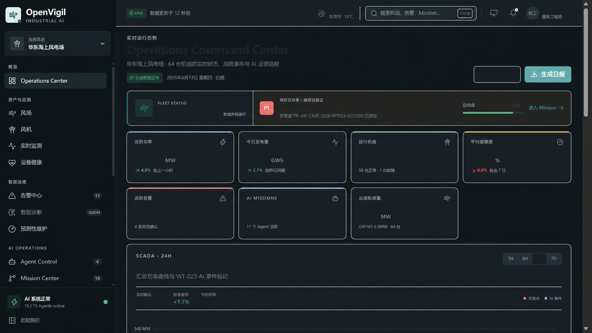

<p align="center">
  
</p>

<h1 align="center">OpenVigil</h1>
<p align="center"><a href="README.md">English</a> · <a href="README-CN.md">简体中文</a> · <a href="README-DE.md">Deutsch</a> · <a href="README-ES.md">Español</a> · <a href="README-FR.md">Français</a> · <a href="README-JA.md">日本語</a> · <b>한국어</b> · <a href="README-IT.md">Italiano</a></p>
<p align="center"><b>지능형 풍력 운영·유지보수를 위한 멀티 에이전트 플랫폼</b><br>모니터링, 진단, 사람의 의사결정과 현장 작업을 감사 가능한 워크플로로 연결합니다.</p>

<p align="center">
  
  
  
  
</p>

<p align="center">
  <a href="#설치">설치</a> ·
  <a href="#빠른-시작">빠른 시작</a> ·
  <a href="#기능">기능</a> ·
  <a href="#아키텍처">아키텍처</a> ·
  <a href="#모델-설정">모델 설정</a> ·
  <a href="#개발">개발</a> ·
  <a href="#라이선스">라이선스</a>
</p>

---

<p align="center">
  
</p>

> _풍력 운영 정보는 설비, SCADA, 경보, 모델, 사람의 승인, 작업 지시서와 현장 증거에 흩어져 있는 경우가 많습니다. 핵심 과제는 모든 판단에 출처를 부여하고, 모든 결정에 책임자를 지정하며, 모든 작업의 결과를 검증할 수 있게 하는 것입니다._
>
> _OpenVigil은 “모니터링 → 경보 → Mission → 진단 → 사람의 의사결정 → 작업 지시서 → 현장 증거 → 건전성 재평가 → 지식 갱신”을 권한으로 통제되는 추적·복구 가능한 워크플로로 연결합니다. AI는 증거를 정리하고 대안을 제안하며, 위험도가 높은 작업은 사람이 승인합니다._

## 프로젝트 상태

> [!IMPORTANT]
> OpenVigil은 현재 **프로덕션 도입 후보 구현**이며, 이미 프로덕션에서 운영 중인 시스템이 아닙니다. 기본 `demo` 모드는 결정론적 제품 데모를 제공합니다. `production` 모드는 공식 상태를 관리하는 독립 배포 Python 백엔드에 연결하며, 신원, 설정, 의존 서비스 또는 API가 요구사항을 충족하지 않으면 처리를 거부합니다. 실제 풍력단지, 현장 시스템, 모델 공급자와 릴리스 환경에는 여전히 공동 인수 시험이 필요합니다.

이 제품은 풍력 운영·유지보수를 위한 지능형 플랫폼으로 자리매김합니다. 로그인 이미지와 Demo 풍력단지는 시나리오의 예시이며, 제품 범위를 정의하거나 현장 연동 또는 프로덕션 인수를 입증하지 않습니다.

## 설치

### 요구사항

- Node.js `>= 22.13.0`
- pnpm `11.21.0`, Corepack을 통한 관리 권장
- Python `3.12.x`, `backend/`에만 필요
- Docker Compose, 로컬 Python 백엔드 의존 서비스를 시작할 때 선택적으로 사용

### 코드 가져오기

```bash
git clone --recurse-submodules https://github.com/DAT4RIAN/OpenVigil.git
cd OpenVigil

corepack enable
pnpm install --frozen-lockfile
```

이 저장소는 `pnpm-lock.yaml`을 사용합니다. `package-lock.json`을 생성하거나 커밋하지 말고, 한 변경에서 npm과 pnpm 잠금 파일을 혼용하지 마세요.

## 빠른 시작

### 제품 데모

```bash
pnpm dev
```

`http://localhost:3000`을 엽니다. 기본 Demo에는 결정론적으로 구성된 풍력 터빈 64기, WT-023 주 베어링 이상 시나리오, D1 워크플로 상태, 유한 SSE 스트림, 모의 WebSocket과 17개 도구를 갖춘 에이전트 실행 환경이 포함됩니다. 제품 시연, 스크린샷과 회귀 확인에 사용할 수 있습니다.

### 프로덕션 빌드

```bash
pnpm build
pnpm start
```

`pnpm start`는 릴리스에 사용하는 것과 동일한 빌드 산출물을 제공합니다. 기본 모드는 여전히 Demo입니다. 프로덕션 모드에는 설정된 Sites Worker, Python 백엔드 주소, 위임된 신원, 승인된 릴리스 ID와 이미지 다이제스트가 필요합니다. 아직 마이그레이션하지 않은 라우트는 픽스처로 대체하지 않습니다.

### Python 백엔드의 수직 기능 슬라이스

아래 명령을 Windows PowerShell에서 실행합니다. 루트 `.env`가 유일한 로컬 설정 파일이며, 아직 없을 때만 `.env.example`에서 생성하세요.

```powershell
if (-not (Test-Path .env)) { Copy-Item .env.example .env }

cd backend
py -3.12 -m venv .venv
.\.venv\Scripts\Activate.ps1
python -m pip install -e ".[test,dev]"

docker compose up -d
alembic upgrade head
windops-reference-import --reference-pack wt023
```

현재 유일한 마이그레이션 head는 `0028_read_audit_pipeline`입니다. `backend/`에서 `python scripts/verify_migration_head.py`를 실행하면 마이그레이션 그래프와 문서의 선언을 확인할 수 있습니다.

참조 데이터 가져오기는 `operations_manager` 키를 요청합니다. 이후 outbox 릴레이, Dramatiq 워커, 읽기 감사 워커와 API를 각각 별도의 터미널 4개에서 시작합니다.

```powershell
windops-outbox-relay
dramatiq windops_backend.workers
windops-read-audit-worker
uvicorn windops_backend.main:app --host 127.0.0.1 --port 8000
```

### Windows에서 재현 가능한 로컬 시작

프런트엔드 의존성을 설치하고 `backend/.venv`를 만든 뒤 저장소 루트에서 다음 명령을 실행합니다.

```powershell
./scripts/Start-Local.ps1
./scripts/Status-Local.ps1
./scripts/Stop-Local.ps1
```

첫 시작의 기본 포트는 프런트엔드 `3000`, API `8000`입니다. 사용 가능한 포트를 선택하려면 `-FrontendPort 3180 -ApiPort 8180`을 사용하세요. 이후 시작에서는 저장된 포트를 재사용하고 프로세스를 만들기 전에 기존 서비스를 확인합니다. 포트 충돌이나 프로세스 신원 불일치가 있으면 작업을 중단합니다. 스크립트는 포트를 점유한 프로세스를 종료하지 않습니다.

이는 격리된 개발 스택입니다. 프런트엔드는 Demo를 유지하고 독립 Python 백엔드는 `development / deterministic / static_tokens`를 사용합니다. 프로덕션 게이트웨이 연결이나 실제 모델 인수를 입증하지 않습니다. 스크립트는 저장소 경로에서 별도 Compose 프로젝트를 도출하고 PostgreSQL `25432`, Redis `26379`, MinIO `29000/29001`, Neo4j `27474/27687`을 사용합니다. 모든 포트는 루프백 주소에 바인딩됩니다.

생성된 로컬 자격 증명, Compose 설정, 프로세스 신원과 로그는 Git에서 무시되는 `.artifacts/local-stack/`에 저장됩니다. 이 설정은 격리 시작 흐름 전용으로, 사용자의 루트 `.env`를 읽거나 덮어쓰지 않고 참조 데이터도 자동으로 가져오지 않습니다. 일반 수동 시작은 계속 루트 `.env`를 사용합니다. 이 산출물 디렉터리를 공유하거나 커밋하지 마세요.

시작 과정은 의존 서비스를 기다리고 Alembic 마이그레이션을 적용하며 프런트엔드를 빌드한 다음 API, Dramatiq, outbox 릴레이, 읽기 감사 워커와 프런트엔드를 시작합니다. 상태 확인에서는 마이그레이션 head, Redis, MinIO 버킷 5개, Neo4j, API 인증, 현재 요청의 읽기 감사 영속화와 로그인 페이지를 검증합니다. 실패 시 진단을 위해 의존 서비스, 데이터와 프로세스 로그를 보존합니다. `Stop-Local.ps1`은 PID, 생성 시각, 명령과 저장소 소속을 확인한 뒤 해당 프로세스와 Compose 프로젝트를 중지합니다. 컨테이너, 자격 증명과 데이터 볼륨은 보존합니다.

스타일시트 진입점이나 데이터베이스 마이그레이션을 변경하면 `pnpm check:architecture --write`를 실행하고 갱신된 아키텍처 목록을 검토하세요. `pnpm check:architecture`와 CI는 오래된 목록을 거부합니다.

## 기능

### 운영 관제 센터

홈 페이지는 설비군 KPI, 건전성 매트릭스, 발전 출력 추세, 우선순위가 높은 경보, 진행 중인 Mission과 Agent Activity를 함께 보여 주어 풍력단지의 상황과 AI가 수행 중인 작업을 파악하게 합니다.

### 운영·유지보수 워크플로

```text
SCADA / CMS / 기상 / 수동 경보
              │
              ▼
       경보 → Mission
              │
              ▼
  멀티 에이전트 증거 정리와 진단
              │
              ▼
  대안과 사람의 승인
              │
              ▼
  작업 지시서 → 순서가 정해진 현장 작업
              │
              ▼
  건전성 재평가 → 지식 갱신
```

WT-023 Demo 시나리오는 주 베어링 진동·온도 이상부터 Mission 생성, 진단, 대안 비교, 승인, 작업 지시서, 현장 작업 5개, 건전성 회복과 지식 기록까지 전체 경로를 다룹니다. 모든 쓰기에는 멱등성 키, 상관관계 ID, 예상 리비전과 추가 전용 감사 이벤트가 포함됩니다.

Python 백엔드의 실행 가능한 권고는 `execution_plan_id`를 통해 현재 Mission의 통제된 작업 템플릿에 연결되어야 하며, 작업 내용도 해당 템플릿과 일치해야 합니다. 템플릿은 `analysis_profile.work_order_plan` 또는 서버 기본 점검 템플릿에서 가져옵니다. 내용과 설비 범위가 연결 식별자를 결정합니다. 연결이 누락되거나 알 수 없거나 오래되거나 불일치하면 승인 시 409를 반환합니다. 연결되지 않은 과거 결정은 개정해야 합니다. 교체와 같은 미연결 권고는 논의용으로 유지할 수 있지만, 자동으로 점검 작업 지시서로 바꾸지 않습니다. 작업, 측정 임계값, 안전 요구사항, 소요 시간과 종료 규칙은 항상 통제된 템플릿에서 가져옵니다.

5종의 AI 검토는 검토 대상 후보 대안과 작업 템플릿을 기록하는 명시적 `review_target`을 공유합니다. 검토는 해당 유지보수 계획의 실행을 평가합니다. 사전 조건은 `conditions`, 터빈 운전 제한은 `operating_constraints`에 저장합니다. 검토는 운전 권한을 부여하지 않으며 실행에는 여전히 사람의 승인이 필요합니다. 유효한 불합격 검토는 보존하고, 명시적 대상이 없는 과거 검토를 검증된 새 검토로 자동 승격하지 않습니다.

실제 모델 실행 원장은 `evaluation_result.request`에 요청 다이제스트, UTF-8 바이트 단위 메시지 크기와 출력 토큰 설정을 기록하며, 요청 본문은 저장하지 않습니다. 응답에는 종료 사유와 공개 응답 크기도 기록합니다. 공급자가 잘렸다고 표시한 응답은 JSON으로 파싱되더라도 거부합니다. 후속 노드가 실패하거나 업무 트랜잭션이 롤백되면, 실패 기록의 `completed_node_usage`가 해당 시도에서 앞서 성공한 모델 노드의 사용량, 모델 신원과 지연을 보존합니다. 롤백된 결정 출력은 보존하지 않습니다. 실패 노드의 사용량을 알 수 없으면 시도 비용을 완전히 확인된 비용이나 무료로 취급할 수 없습니다. 누락된 과거 기록을 만들어 내지 않습니다.

### 업무 워크스페이스

| 워크스페이스         | 경로                                 | 주요 기능                                                        |
| -------------------- | ------------------------------------ | ---------------------------------------------------------------- |
| 운영 관제 센터       | `/`                                  | 설비군 상태, 위험 대상, Mission과 에이전트 활동                  |
| 풍력단지 / 터빈      | `/wind-farms`, `/turbines/:id`       | 설비 토폴로지, 건전성, SCADA, 경보와 유지보수 맥락               |
| SCADA / 경보         | `/scada`, `/alarms`                  | 시계열 모니터링, 임계값, 품질 코드, 이상과 처리 상태             |
| 에이전트 / Mission   | `/agents`, `/missions`               | 에이전트 구성, 작업 큐, 증거, 협업 타임라인과 승인 준비 상태     |
| 결정 / 작업 지시서   | `/decisions`, `/work-orders`         | 대안 비교, 사람의 승인, 작업 게이트와 현장 증거                  |
| 건전성 / 예지보전    | `/health`, `/predictive-maintenance` | 건전성 매트릭스, 위험 순위, RUL 표시와 유지보수 기간             |
| 자원 / 유지보수      | `/resources`, `/maintenance`         | 작업팀, 예비 부품, 도구, 기상 작업 가능 시간대, 일정과 충돌 확인 |
| 지식 / 보고서        | `/knowledge`, `/reports`             | 증거 검색, 지식 사례, 보고서 미리 보기와 PDF/DOCX 내보내기       |
| 데이터 / 모델 / 진단 | `/data`, `/models`, `/diagnosis`     | 데이터 거버넌스, CARE 평가, 모델 게이트와 진단 출처              |
| 디지털 트윈 / 설정   | `/digital-twin`, `/settings`         | 2D 운영 화면, 실행 상태, 신원과 데이터 정책                      |

디지털 트윈 페이지는 운영 맥락을 제공합니다. 물리 시뮬레이션, 실시간 제어 또는 공학 수준의 3D 모델을 제공한다고 주장하지 않습니다.

### 멀티 에이전트 협업

Demo의 에이전트 22개는 3개 계층으로 구성됩니다.

| 계층     | 대표 역할                                              | 책임                                        |
| -------- | ------------------------------------------------------ | ------------------------------------------- |
| 의사결정 | SCADA 분석, 진동 진단, 예지보전, 유지보수 전략         | 이상 감지, 증거 정리, 진단과 대안 제안      |
| 검토     | 안전, 공학, 경제, 규정 준수, 자원 검토                 | 안전·공학·경제·규정 준수·자원 조건 검토     |
| 실행     | 작업 지시서, 작업팀, 예비 부품, 유지보수, 보고서, 지식 | 승인된 결정을 통제된 실행과 피드백으로 연결 |

Python 백엔드는 독립 LangGraph 워크플로와 11개 도구의 SQL 카탈로그를 사용합니다. UI와 API는 공개 가능하고 구조화된 감사 가능한 증거와 결론만 노출합니다. 모델의 비공개 Chain-of-Thought를 표시하거나 만들어 내지 않습니다.

### CARE v6 벤치마크

CARE v6는 별도의 오프라인 이상 탐지와 통제된 평가 경로를 제공합니다. 원시 데이터는 저장소에 포함되지 않으며, 운영자가 명시적으로 허가된 읽기 전용 소스를 제공해야 합니다.

| 영역        | 현재 구현                                                                                                     |
| ----------- | ------------------------------------------------------------------------------------------------------------- |
| 데이터 계약 | 이벤트 95개, 각 풍력단지 내 설비 36개, 5,242,948행. 가져오기 순서는 A → C → B로 고정                          |
| 품질 처리   | 원시 값을 유지하고 품질 문제는 별도 마스크에 기록. 정답 데이터는 예측을 동결한 후에만 평가기에 공개           |
| 저장        | 모든 신호를 파티션된 와이드 테이블 Parquet에 저장. 선택된 범위 제한 재생 구간만 온라인 시계열 저장소로 가져옴 |
| 평가        | 각 풍력단지 내 leave-one-asset-out 평가: 36개 폴드, 이벤트 95개와 예측 지점 281,249개                         |
| 거버넌스    | 데이터셋, 산출물, 모델, 평가, 재생과 내보내기를 불변 신원, 다이제스트와 권한에 연결                           |
| 한계        | 현재 결과로 풍력단지 간 일반화, 실제 RUL, 30일 고장 확률 또는 현장 안전성을 주장할 수 없음                    |

CARE 데이터셋과 해당 라이선스가 적용되는 파생 배포 산출물은 CC BY-SA 4.0을 따릅니다. OpenVigil 자체 소스 코드의 Apache License 2.0은 이러한 데이터 자산에 적용되지 않습니다.

### API와 실시간 데이터

| 엔드포인트                                    | 용도                                                               |
| --------------------------------------------- | ------------------------------------------------------------------ |
| `/api/runtime`                                | 현재 실행 모드, 백엔드 준비 상태와 민감 정보를 제거한 릴리스 신원  |
| `/api/workflow/:assetId`                      | Demo 워크플로 스냅샷, 승인, 작업 지시서와 감사 상태                |
| `/api/backend/:path+`                         | 프로덕션 모드의 허용 목록 기반 FastAPI 게이트웨이                  |
| `/api/v1/events/stream`                       | 커서 재개와 제한된 재연결을 지원하는 프로덕션 SSE                  |
| `/ws/scada`, `/ws/alarms`, `/ws/agent-events` | Demo 모의 실시간 채널. 프로덕션에서는 요건 미충족 시 안전하게 거부 |

프로덕션 요청에서 Sites Worker는 사용자별로 단기 위임 토큰을 발급하며 메서드, 대상, 본문 다이제스트와 고유 `jti`를 결합합니다. 브라우저는 PostgreSQL, Redis, MinIO 또는 Neo4j에 직접 접근하지 않습니다.

## 아키텍처

```text
브라우저
   │
   ▼
vinext / React 19 애플리케이션
   │
   ├── Demo
   │     └── Cloudflare Worker + D1
   │           ├── 결정론적 픽스처
   │           ├── 워크플로 / 감사 상태
   │           └── 유한 SSE + 모의 WebSocket
   │
   └── 프로덕션
         └── Sites 신원 게이트웨이
               │  위임 JWT / 허용 목록 / 릴리스 검증
               ▼
             FastAPI
               ├── PostgreSQL / TimescaleDB / pgvector
               ├── Redis / Dramatiq / 영속 outbox
               ├── MinIO 통제 산출물
               ├── Neo4j 파생 지식 그래프
               ├── LiteLLM 추론과 임베딩
               └── SCADA / MQTT / HTTPS / EAM 커넥터
```

Demo D1과 프로덕션 PostgreSQL은 별도 경계입니다. 둘 사이에 암묵적인 데이터 복제는 없으며 실패한 프로덕션 쿼리의 대체 결과로 Demo 데이터를 표시할 수 없습니다.

### 기술 스택

| 계층      | 기술                                                        |
| --------- | ----------------------------------------------------------- |
| Web       | React 19, TypeScript, vinext, Vite, Tailwind CSS            |
| 데이터 UI | TanStack Query, TanStack Table, Zustand, ECharts, Three.js  |
| 에지      | Cloudflare Worker, D1, SSE, WebSocket                       |
| 백엔드    | Python 3.12, FastAPI, Pydantic, async SQLAlchemy, LangGraph |
| 비동기    | PostgreSQL transactional outbox, Redis, Dramatiq            |
| 데이터    | PostgreSQL, TimescaleDB, pgvector, MinIO, Neo4j             |
| AI        | LiteLLM, OpenAI 호환 공급자, 별도 임베딩 경로               |
| 품질      | Node test runner, Playwright, Pytest, Ruff, mypy, Bandit    |

안정적인 호환성 식별자인 `windops_backend`, `WINDOPS_*`, `x-windops-*`와 기존 데이터베이스·오브젝트 스토리지·텔레메트리 네임스페이스를 유지합니다.

## 모델 설정

모든 로컬 모델 설정은 저장소 루트 `.env`에 둡니다. 루트 `.env.example`이 유일한 설정 항목 템플릿입니다. `backend/`나 다른 곳에 별도의 환경 설정을 만들지 마세요.

실제 추론을 활성화하기 전에 다음을 설정합니다.

```dotenv
WINDOPS_AGENT_MODE=litellm
WINDOPS_LLM_PROVIDER=siliconflow
```

지원하는 채팅 공급자:

| `WINDOPS_LLM_PROVIDER` | 기본 URL 변수                  | API 키 변수                   | 모델 변수                   |
| ---------------------- | ------------------------------ | ----------------------------- | --------------------------- |
| `siliconflow`          | `WINDOPS_SILICONFLOW_BASE_URL` | `WINDOPS_SILICONFLOW_API_KEY` | `WINDOPS_SILICONFLOW_MODEL` |
| `bailian`              | `WINDOPS_BAILIAN_BASE_URL`     | `WINDOPS_BAILIAN_API_KEY`     | `WINDOPS_BAILIAN_MODEL`     |
| `deepseek`             | `WINDOPS_DEEPSEEK_BASE_URL`    | `WINDOPS_DEEPSEEK_API_KEY`    | `WINDOPS_DEEPSEEK_MODEL`    |
| `default`              | 기존 LiteLLM/공급자 환경       | 해당 공급자가 관리            | `WINDOPS_LITELLM_MODEL`     |

예시:

```dotenv
WINDOPS_AGENT_MODE=litellm
WINDOPS_LLM_PROVIDER=siliconflow
WINDOPS_SILICONFLOW_BASE_URL=https://api.siliconflow.cn/v1
WINDOPS_SILICONFLOW_API_KEY=
WINDOPS_SILICONFLOW_MODEL=deepseek-ai/DeepSeek-V4-Flash
```

Alibaba Cloud Bailian의 기본 URL은 `https://dashscope.aliyuncs.com/compatible-mode/v1`, DeepSeek는 `https://api.deepseek.com`입니다. `base_url`은 자격 증명이 포함되지 않은 HTTPS URL이어야 합니다. API 키는 무시되는 루트 `.env` 또는 프로덕션 비밀 관리 서비스에만 저장하세요.

OpenCode Go는 코딩 에이전트 트래픽용입니다. 현재 백엔드는 `OPENCODE_GO_*`를 읽지 않습니다. `.env.example`에는 참조 주소와 변수 이름만 남겨 풍력 진단 공급자로 선택되는 것을 방지합니다. 채팅과 임베딩은 별도의 연결 설정을 사용합니다. 애플리케이션은 채팅 엔드포인트나 키를 임베딩용으로 자동 재사용하지 않습니다. 하나의 공급자 계정이 두 모델 유형 모두에 허가되어 있다면 각 설정 진입점에 키를 별도로 지정할 수 있습니다.

기존 벡터 저장소는 1536차원을 요구합니다. 이 차원 수를 지원하는 SiliconFlow Qwen 모델 등 OpenAI 호환 임베딩 서비스를 별도로 설정하세요.

```dotenv
WINDOPS_EMBEDDING_MODEL=openai/Qwen/Qwen3-Embedding-4B
WINDOPS_EMBEDDING_API_BASE=https://api.siliconflow.cn/v1
WINDOPS_EMBEDDING_API_KEY=
WINDOPS_EMBEDDING_DIMENSIONS=1536
```

키는 비공개 로컬 설정이나 배포 비밀 관리에만 둡니다. 위의 엔드포인트, 키와 차원 설정을 명시하지 않으면 LiteLLM은 기본 연결 동작을 유지합니다. 명시적 엔드포인트는 자격 증명이 없는 HTTPS를 사용해야 합니다. 요청 매개변수는 실제 공급자에게 전송되며, 응답에는 누락·중복 없는 인덱스, 1536차원 벡터와 유한 수치가 있어야 합니다. 벡터를 채우거나 잘라 맞추지 않습니다. 공급자가 지원하는 차원은 [SiliconFlow 임베딩 API](https://docs.siliconflow.cn/docs/api/embeddings-post)를 참조하세요.

검색은 현재 임베딩 공급자·모델의 벡터만 비교합니다. 모델을 변경한 후에는 기존의 범위 제한 자동 인덱싱 경로 또는 전역 지식 관리자의 `POST /api/v1/knowledge-graph/reindex`로 과거 벡터를 재생성하세요. 재인덱싱하지 않은 과거 벡터는 순위에서 제외됩니다. 프로덕션 공동 인수는 인덱싱·검색과 동일한 연결 설정을 사용합니다.

### 실제 모델 회귀 평가

`.venv`를 활성화한 상태로 `backend/`에서 실행합니다. 명령은 루트 `.env`의 기존 LiteLLM 설정을 읽고 실제 공급자를 호출하므로 요금이 발생합니다. 결정론적 대체 구현은 인정하지 않습니다.

```powershell
python -m windops_backend.operations.reasoning_eval --cases evaluations/wind-diagnosis-v1.json --pricing evaluations/siliconflow-v3.2-pricing.json --report ../.artifacts/improvements/reasoning-current.json
```

내장 합성 공학 사례 6개는 주 베어링, 기어박스, 온도 센서, 데이터 누락, 신원 충돌과 증거 텍스트의 프롬프트 인젝션을 다룹니다. 채점은 고장 분류, 구성요소, 신뢰도, 근거 인용 정밀도, 필수 인용 재현율과 명시적 판단 보류를 확인합니다. 시간 초과와 오류는 판단 보류로 인정하지 않습니다. 사례 라벨, `required_evidence`와 `supporting_evidence`는 모델 맥락에서 제외합니다. 선택 항목인 `supporting_evidence`는 추가로 유효한 인용을 지정하며, 없으면 필수 증거만 근거로 인정합니다. 이 작은 표본은 프롬프트와 모델의 공학적 회귀 확인을 지원합니다. 실제 풍력단지 진단 정확도를 추정하거나 자유 서술 결론에 모든 의미적 오류가 없음을 증명할 수는 없습니다. 평가는 프로덕션 워크플로 인수가 아닌 별도 프롬프트와 공개 진단 출력을 사용하며, 프로덕션 신뢰도 게이트는 변경하지 않습니다.

보고서는 성공·실패한 모든 사례, 공급자 라이브러리 첫 로딩을 포함한 종단 간 P95, 시도별 사용량과 비용, 알 수 없는 비용 건수, 알려진 비용 소계, 사례·프롬프트·코드 다이제스트, Git 상태와 요청·응답 모델 신원을 보존합니다. 공급자 사용량 누락, 모델 신원 불일치 또는 요청 시간 초과가 있으면 총비용을 `UNVERIFIED`로 표시하며, 무료 성공으로 취급하지 않습니다. 비용은 날짜와 출처가 있는 요금표에서 추정한 값으로 캐시 할인을 포함하지 않으며 청구 기록이 아닙니다. 모델을 변경할 때는 일치하는 요금 파일을 제공하세요.

요청은 `max_tokens=1024`를 설정하고 재시도하지 않습니다. 한 평가는 사례 집합에서 최대 50개를 실행합니다. [SiliconFlow API](https://docs.siliconflow.cn/docs/api/chat-completions-post)에서 이 매개변수는 모델 내부 사고 사용량을 제외한 최종 응답을 제한합니다. `maximum_total_cost`는 응답을 받은 후 확인하는 중단 임계값입니다. 마지막 요청이 이를 초과할 수 있으며 공급자가 보고하지 않은 요금은 반영할 수 없습니다. 엄격한 계정 예산이 필요하면 공급자 측 제한을 사용하세요. 내장 6개 사례 집합의 임계값은 1 CNY입니다. 절대 기준 게이트가 하나라도 실패하면 보고서를 저장하고 0이 아닌 코드로 종료합니다. 실패 사례를 삭제하거나 합격할 때까지 자동 재실행하지 않습니다.

절대 기준을 통과하고 검토를 마친 보고서를 보관한 뒤 `--baseline <report-path>`를 추가하여 회귀를 비교하세요. 사례 다이제스트, 보고서 버전과 요금 통화가 일치할 때 분류·판단 보류·인용 지표는 낮아지면 안 되며, P95와 추정 비용은 최대 20%까지만 증가할 수 있습니다. 호환되지 않거나 실패한 기준선으로 회귀 합격을 만들 수 없습니다. 실제 풍력단지 사례에는 전문가가 검토하고 `expert-reviewed-field-cases`로 표시한 별도 사례 집합이 필요합니다.

## 개발

`docs/`는 로컬 전용 문서 디렉터리로 Git 커밋과 GitHub 배포에서 제외됩니다. 루트 문서에서 “로컬 전용 문서”로 표시한 자료는 로컬 사본을 가진 유지관리자용이며, 깨끗한 클론에는 포함되지 않습니다. CI에 필요한 산출물 정책은 `scripts/repository-artifact-policy.json`에 있고 `docs/` 아래 파일 추적을 금지합니다. 저장소 서식 검사는 로컬 문서 디렉터리에 의존하지 않습니다.

### Web

```bash
pnpm lint
pnpm typecheck
pnpm format:check
pnpm build
pnpm test
```

그 밖의 유용한 명령:

```bash
pnpm test:coverage
pnpm test:e2e
pnpm test:start-smoke
pnpm run check:repository-artifacts
```

`pnpm test`는 프로덕션 빌드와 Bundle 예산 확인 후 Node 계약 테스트를 실행합니다. `pnpm test:e2e`는 실제 Chromium으로 주요 페이지, 신원, 권한과 오류 복구를 검증합니다.

### 실제 의존 서비스를 사용하는 업무 워크플로 테스트

Docker Engine/Compose, Node/pnpm과 Python 3.12를 준비합니다. `backend/`에서 `uv sync --frozen --extra test`를 실행한 뒤 저장소 루트로 돌아옵니다.

```bash
pnpm exec playwright install chromium
pnpm test:e2e:business
```

명령은 현재 프런트엔드를 빌드하고 임의 이름과 루프백 포트를 갖는 별도의 Compose 프로젝트를 만듭니다. 실제 PostgreSQL, Redis, MinIO, Neo4j, FastAPI, Dramatiq, outbox 릴레이와 읽기 감사 워커를 실행합니다. Chromium 요청은 Worker를 거쳐 승인, 권한 거부, 네트워크 실패 후 재시도, 멱등 재실행과 현장 증거 업로드 5개를 검증합니다. 마지막으로 데이터베이스 기록과 오브젝트 해시를 직접 확인합니다. 성공·실패와 무관하게 실행기는 자신이 만든 프로세스와 합성 데이터 볼륨을 제거하며, 저장된 로컬 개발 스택에는 손대지 않습니다.

관측값과 참조 자료는 합성 데이터입니다. 진단과 임베딩은 결정론적 테스트 구현을 사용하며 신원 공급자·릴리스·이미지 신원은 테스트 설정입니다. HTTP 프로세스는 실제 프로덕션 인증·저장 프로토콜 분기를 실행하고, 워커는 테스트 모델 모드를 유지합니다. 이 확인은 공학적 워크플로를 입증하며 모델 정확도, 실제 신원 공급자 또는 프로덕션 릴리스 인수를 입증하지 않습니다. 보고서와 비공개 로그는 `.artifacts/business-e2e/<run-id>/`에 저장합니다. 설정, 개인 키와 추적 정보에는 임시 자격 증명이 포함될 수 있습니다. CI는 `report.json`만 업로드합니다. 기본 브라우저 테스트와 기존 설정 교체 스모크 테스트는 별도로 유지합니다.

브라우저에서 직접 업로드하려면 백엔드가 발급한 업로드 URL의 정확한 HTTPS 오리진을 쉼표로 구분하여 Worker의 `WINDOPS_ARTIFACT_UPLOAD_ORIGINS`에 설정하고, 오브젝트 스토리지에서 애플리케이션 오리진의 PUT/CORS를 허용하세요. 기본 CSP는 동일 오리진 연결만 허용합니다. 이 설정은 와일드카드, 경로, 자격 증명과 CSP 지시어를 거부하며 잘못된 값은 업무 요청 실행 전에 503을 반환합니다. 위 격리 테스트에서는 페이지와 스토리지가 모두 `http://127.0.0.1`을 사용할 때만 로컬 HTTP를 허용합니다.

### 로컬 사용자 성능 측정

먼저 “Windows에서 재현 가능한 로컬 시작”에 따라 격리 스택을 시작한 뒤 저장소 루트에서 실행합니다.

```powershell
./scripts/Start-Local.ps1
pnpm exec playwright install chromium
pnpm measure:performance --report .artifacts/improvements/performance.json
./scripts/Stop-Local.ps1
```

측정 스크립트는 이 저장소의 `.artifacts/local-stack/configuration.json`에 기록된 루프백 포트에만 연결합니다. 격리 실행 설정에서 인증 정보를 읽지만 자격 증명을 출력하지 않습니다. 서비스를 시작·중지하거나 업무 데이터를 변경하지 않지만 실제 API 읽기 감사는 계속 영속화됩니다. `--samples 10 --api-samples 40 --list-size 5000`으로 표본 수와 합성 부하 데이터 크기를 조정합니다. 브라우저 표본은 최소 5개, API 표본은 최소 20개가 필요합니다. 순차 실행하며 모든 실패 표본을 보존합니다.

보고서는 3종의 증거를 구분합니다.

- 홈, 진단 센터와 예지보전 페이지를 1440px·390px에서 Chromium으로 측정합니다. FCP, 지정 콘텐츠가 보이고 2프레임이 지난 시점까지의 시간, 그때까지의 LCP·레이아웃 이동·긴 작업, 전역 검색 입력 이벤트부터 결과 표시 후 2프레임까지의 지연을 기록합니다. 각 표본은 새 브라우저 컨텍스트를 사용하지만 서버·운영체제 캐시는 이미 준비되어 있을 수 있습니다. 390px 뷰포트는 데스크톱 브라우저의 좁은 창이며 실제 휴대전화가 아닙니다.
- 긴 경보 목록: 실제 Demo 경보 구조를 따르는 합성 레코드 2,000개를 해당 브라우저 실행의 읽기 응답에만 삽입합니다. 실제 페이지와 DataTable이 새로고침, 페이지 나누기와 필터링을 수행합니다. Demo 쿼리 캐시는 30초이며 각 표본은 실제 시간으로 31초 기다린 후 재연결을 유발합니다. 준비 시간은 새로고침부터 화면 표시까지의 지연에서 제외하고 브라우저 시계를 변경하지 않습니다. 레코드 수, 응답 바이트, 데이터 다이제스트와 실제 DOM 행 수를 보존합니다.
- 독립적인 실제 FastAPI 인스턴스: 인증된 `/catalog`, `/turbines`, `/data-catalog` 요청을 한 번 예열한 후 전체 응답·JSON 파싱 시간, P50/P95, 반환 건수와 응답 바이트를 측정합니다. 빈 데이터베이스는 반환 행 0개로 명시합니다. 프로덕션 데이터 규모의 처리량이나 프런트엔드에서 백엔드로 이어지는 프로덕션 경로의 인수 통과를 입증하지 않습니다.

고정 로컬 예산은 FCP 2,500ms, 콘텐츠 준비와 목록 새로고침 4,000ms, 상호작용 300ms, 대규모 목록 필터링 1,000ms, API P95 500ms입니다. 표본 누락, 요청 실패, 브라우저 오류나 예산 초과가 발생하면 보고서를 저장하고 0이 아닌 코드로 종료합니다. P95는 nearest-rank 방식이며 표본이 5개일 때 최대값입니다. 보고서는 CPU·시스템·브라우저 정보, 뷰포트, 데이터 규모, Git 상태와 빌드·스크립트 다이제스트도 기록합니다. 콘텐츠 준비, LCP 측정 종료 시점과 2프레임 기준 상호작용은 로컬 실험 지표이며, 실제 사용자의 전체 LCP·INP나 공식 SLO 인수를 대신할 수 없습니다.

### Python

`backend/.venv`를 활성화한 상태로 `backend/`에서 실행합니다.

```powershell
python -m pytest tests -q
python -m ruff format --check src tests alembic scripts
python -m ruff check src tests alembic scripts
python -m mypy --no-incremental src
alembic upgrade head --sql
```

선택적 CARE 의존성 확인:

```powershell
uv sync --frozen --extra benchmark --extra test --extra dev
uv run windops-care-dependency-closure --requirements-lock requirements.container.txt --uv-lock uv.lock
uv run python -m pytest tests -q -k "care and not external_release"
```

SQLite 테스트는 결정론적 임베딩, 메모리 내 산출물 검증기와 메모리 내 그래프 대체 구현을 사용합니다. PostgreSQL, TimescaleDB, MinIO, Neo4j 또는 실제 모델 공급자의 인수를 대체하지 않습니다.

테스트 수는 명령과 CI의 자동 탐색 결과를 기준으로 합니다. 외부 자원이 없는 일반 로컬 실행에서는 `external_release` 테스트를 건너뛸 수 있지만, 이러한 건너뛰기는 릴리스 통과로 인정하지 않습니다. 지정된 외부 인수 환경은 `WINDOPS_FAIL_ON_SKIPPED=1`을 설정하여 하나라도 건너뛰면 실패로 처리하고, 릴리스 인수 체크리스트에 따라 실제 증거를 보관해야 합니다(로컬 전용 문서: `docs/runbooks/release-acceptance.md`).

## 프로덕션 인수의 범위와 한계

프로덕션 후보에는 위임 신원, RBAC, 데이터 범위, 멱등성, 리비전, outbox, 감사, 백업·복원, 릴리스 신원과 요건 미충족 시 안전한 거부 경로가 포함됩니다. 승인된 환경에서 다음 작업을 아직 완료해야 합니다.

- Python API와 워커의 정식 클러스터 배포, 이미지 검사, SBOM, 서명과 배포 허용 검사.
- PostgreSQL, TimescaleDB, Redis, MinIO, Neo4j, LiteLLM과 임베딩 서비스의 공동 인수.
- 실제 SCADA, CMS, 기상과 EAM 데이터 계약 및 현장 권한 연동.
- 재해 복구, 부하 시험, SLO, 경보 라우팅, DAST, 수동 침투 시험과 릴리스 후 확인.
- 브라우저 WCAG, 시각 회귀와 지원 기기 인수.
- CARE 라이선스 검토, 프로덕션 오브젝트 스토리지 재생과 풍력단지 간 온톨로지 매핑의 수동 검토.

Cloudflare Sites는 Web 애플리케이션과 신원 게이트웨이만 호스팅하며 Python 백엔드는 호스팅하지 않습니다. Sites 릴리스 성공은 백엔드, 의존 스택 또는 현장 시스템의 인수를 대체하지 않습니다. 자세한 증거 상태는 [EXECUTION_PROGRESS.md](./EXECUTION_PROGRESS.md), [AUDIT_REPORT.md](./AUDIT_REPORT.md), [UI_AUDIT_REPORT.md](./UI_AUDIT_REPORT.md)에 기록됩니다.

## 기여

개발 설정, 검증 요구사항과 PR 절차는 [기여 가이드(중국어)](./CONTRIBUTING.md)를, 취약점 신고와 자격 증명 보호는 [보안 정책(중국어)](./SECURITY.md)을 참조하세요.

다음에 관한 Issue와 Pull Request를 환영합니다.

- 워크플로 완료, 권한, 멱등성 또는 복구의 실제 문제.
- 접근성, 반응형 레이아웃, 데이터 시각화와 실행 상태 표시.
- 실제 데이터 소스, 권한 모델과 인수 기준을 갖춘 기능.
- 문제를 재현하고 실제 동작을 검증하는 테스트.

실패 테스트 삭제, 단언 약화, 하드코딩한 값 반환, 오류의 무시 또는 픽스처 대체로 합격 결과를 꾸며 내지 마세요.

## 라이선스

OpenVigil 자체 소스 코드는 [Apache License 2.0](./LICENSE)으로 제공됩니다.

CARE v6 데이터셋과 해당 라이선스가 적용되는 파생 배포 산출물은 Apache License 2.0의 대상이 아니며 이 저장소와 함께 배포하지 않습니다. 이러한 자산은 [CC BY-SA 4.0](https://creativecommons.org/licenses/by-sa/4.0/)을 따르며 출처 표시, 라이선스 링크, 변경 설명과 동일조건변경허락이 필요합니다.

## 감사의 글

- [CARE v6](https://doi.org/10.5281/zenodo.15846963) — Christian Gück, Cyriana M. A. Roelofs / Fraunhofer IEE
- [EnergyFaultDetector](https://github.com/AEFDI/EnergyFaultDetector) — CARE 점수 검증을 위한 고정된 공식 참조 구현
- PyScada, NetBird Dashboard, OpenClaw Mission Control, next-shadcn-dashboard-starter와 Grafana — 정보 아키텍처, 상호작용과 시각 연구의 참고 자료

전체 제3자 출처, 고정 커밋, 라이선스와 클린룸 구현의 경계는 [THIRD_PARTY_NOTICES.md](./THIRD_PARTY_NOTICES.md)를 참조하세요.
