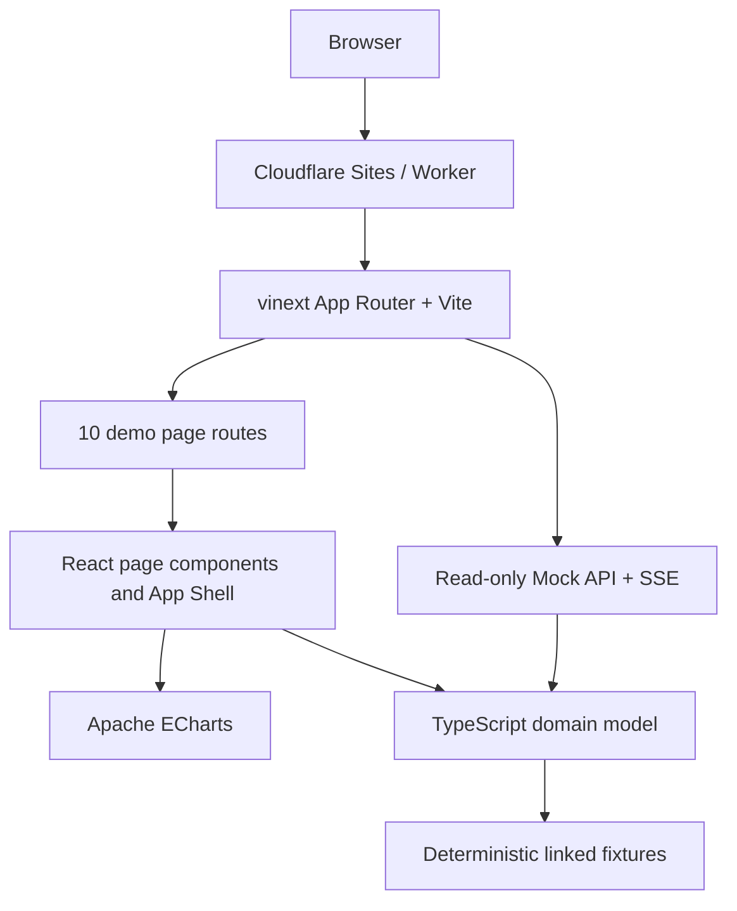
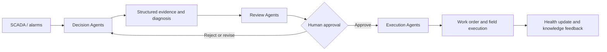

# WindOps Multi-Agent Platform

> AI-Native Multi-Agent Operations Platform for Wind Farms  
> 风电运维多智能体平台

WindOps 是一个面向海上风电智能运维场景的作品集级 Web 演示：它把风场态势、SCADA 时序、工业告警、设备健康、Multi-Agent Mission、可解释决策、人工审批与工单执行组织成一条可追踪的业务闭环。

首页的重点不是聊天框，而是回答两个问题：**整个风场现在发生了什么，以及 AI 正在处理什么。**

## 项目状态

> [!IMPORTANT]
> 当前仓库是可运行的前端产品演示与领域原型，不是生产 SCADA、自动控制系统或已上线的 Agent 后端。所有风机、告警、气象、诊断与审批数据均为确定性模拟数据，不得用于真实设备控制、安全判断或维护决策。

| 当前已实现 | 尚未实现 / 生产目标 |
| --- | --- |
| React 19 + TypeScript 严格模式的 10 个核心页面 | 真实 SCADA、CMS、气象与 ERP/EAM 接入 |
| vinext / Vite 应用与 Cloudflare Sites 运行形态 | FastAPI 服务、持久化数据库与 WebSocket 数据总线 |
| ECharts 时序图、阈值与 AI 事件标记 | TimescaleDB / PostgreSQL 历史时序存储 |
| 类型安全、跨页面关联的确定性 Mock Data | LangGraph / LLM 的真实 Agent 编排与 Tool Calling |
| 只读 Mock API 与 Agent Event SSE 演示接口 | pgvector RAG、文档摄取与可验证检索链路 |
| Human-in-the-loop 审批交互演示 | RBAC、不可变审计日志、策略引擎与生产级安全控制 |

## 界面预览

截图位已预留，建议使用 `1440 × 900` 浅色主题捕获以下页面；当前仓库不提交占位二进制图片，以免 README 出现失效资源。

| 截图位 | 本地路由 | 建议文件名 |
| --- | --- | --- |
| Operations Command Center | `http://localhost:3000/` | `docs/screenshots/operations-command-center.png` |
| WT-023 Mission Detail | `http://localhost:3000/missions/MISSION-2026-0823` | `docs/screenshots/mission-wt-023.png` |
| SCADA Monitoring | `http://localhost:3000/scada` | `docs/screenshots/scada-monitoring.png` |

## 核心能力

- 工业控制中心式 App Shell：分组侧栏、Topbar、响应式导航、深浅主题与 `Ctrl/Cmd + K` Command Palette。
- 风场资产视图：1 个海上风场、64 台 6 MW 风机、统一状态语义、卡片/列表/拓扑切换与详情 Drawer。
- SCADA 监测：17 类关联测点、24 小时曲线、阈值、异常标记、AI 事件标记与 Tooltip/Zoom。
- 工业告警：严重度、状态、AI 分析状态、责任人与关联 Mission 的统一数据表。
- Multi-Agent Operations：15 个专业 Agent、10 个 Mission、结构化活动时间线与三层组织视图。
- 可解释决策：证据、三个备选方案、安全/成本/停机/发电损失/天气/资源权衡。
- Human-in-the-loop：高风险动作必须经过工程审核与人工批准，UI 不展示模型隐藏思维链。
- 工单闭环：Decision、Approval、Work Order、人员、船舶、工具、备件和安全措施保持可追溯关联。
- 确定性领域数据：刷新、构建和测试不会生成随机业务事实，便于演示、截图与回归检查。

## 10 个核心页面

| # | 页面 | 路由 | 重点 |
| ---: | --- | --- | --- |
| 01 | Operations Command Center | `/` | 全场 KPI、功率趋势、健康分布、高优告警、活跃 Mission 与 Agent Activity |
| 02 | Wind Farm Overview | `/wind-farms` | 64 台风机的卡片、列表、拓扑、筛选与快速详情 |
| 03 | Wind Turbine Detail | `/turbines/WT-023` | 数字资产、12 个子系统健康、SCADA、告警、Mission、维护与文档标签页 |
| 04 | SCADA Monitoring | `/scada` | 17 类时序测点、阈值、异常与 AI 事件联合监控 |
| 05 | Alarm Center | `/alarms` | 工业告警表、分级筛选、详情 Drawer 与 AI Diagnosis |
| 06 | Agent Control Center | `/agents` | Agent 状态、三层组织、任务队列、工具与运行指标 |
| 07 | Mission Center | `/missions` | 从 Detected 到 Completed 的任务看板与筛选 |
| 08 | Mission Detail | `/missions/MISSION-2026-0823` | 结构化协作时间线、证据、当前决策、审批与执行准备度 |
| 09 | Decision Center | `/decisions` | 三方案比较、推荐理由、风险权衡与人工审批交互 |
| 10 | Work Order Center | `/work-orders` | 工单状态、任务清单、PPE、工具、备件与安全程序 |

## 当前架构



当前数据路径全部留在同一个 TypeScript 项目中：页面与 API 共享 `lib/` 的规范化领域对象，避免组件各自维护互相矛盾的 Mock。`drizzle-orm` 与 D1 示例仍是脚手架能力；当前 `.openai/hosting.json` 没有启用 D1 或 R2 绑定，演示也不依赖数据库。

### 目录结构

```text
app/                     vinext 页面入口与只读 Mock API
components/
  charts/                ECharts 时序组件
  data-display/          指标卡、状态与健康语义组件
  layout/                App Shell、Sidebar、Topbar、Page Header
  pages/                 10 个领域页面
lib/
  types.ts               领域类型
  farm-data.ts           风场与 64 台风机
  telemetry-data.ts      SCADA、健康与气象窗口
  agent-data.ts          三层 Agent 组织
  operations-data.ts     告警、证据、Mission、Decision、工单与事件
  knowledge-data.ts      可引用知识文档
worker/                  Cloudflare Worker 入口
tests/                   构建产物与 API 契约测试
```

## Multi-Agent Architecture

演示中的 15 个 Agent 按职责分为三层：

| 层级 | Agent | 职责 |
| --- | --- | --- |
| Decision | Operations Coordinator、SCADA Analysis、Vibration Diagnosis、Failure Diagnosis、Predictive Maintenance、Meteorological Risk、Maintenance Strategy | 发现异常、形成证据、诊断故障、预测风险并提出候选方案 |
| Review | Safety Review、Engineering Review、Economic Review、Resource Review | 审核安全、工程可行性、经济性、天气与资源条件 |
| Execution | Work Order、Crew Scheduling、Vessel Scheduling、Knowledge | 将批准决策转换为工单、排班、船舶计划和知识记录 |



这里展示的是可公开、可审计的事件、证据、工具结果和决策摘要，**不展示也不伪造模型的隐藏 Chain-of-Thought**。当前这些协作记录是类型安全的演示数据，并未运行 LangGraph 或调用 LLM。

## Demo Scenario：WT-023 主轴承异常

所有核心页面共享同一条 `WT-023` 故事线，而不是互不相关的样例卡片。

### 1. 感知与证据

| 信号 | 基线 | 当前值 / 变化 | 解释 |
| --- | ---: | ---: | --- |
| Main Bearing Vibration RMS | `3.79 mm/s` | `4.81 mm/s`，`+27%` | 跨越 `4.5 mm/s` Warning 阈值，连续 44 个采样点上升 |
| Main Bearing Temperature | `68.0°C` | `76.4°C`，`+8.4°C` | 高于 `75°C` 阈值 |
| Active Power Fluctuation | 同风速 7 日基线 | `+6%` | 与传动链扰动同步 |
| Multivariate Anomaly Score | `0.18` | `0.86` | 跨越 `0.65` 告警阈值 |
| BPFO band energy | — | `+19%` | 包络谱出现外圈故障特征边带 |

Knowledge Agent 找到 12 个历史主轴承案例，最高相似度 `0.91`；Predictive Maintenance Agent 将主轴承健康评分更新为 `63`，给出 30 日失效概率 `34%`、预计 RUL `47 天`。

### 2. 协作、决策与执行

```text
02:14:03  SCADA Analysis Agent 检测到振动趋势异常
02:14:08  Vibration Diagnosis Agent 启动高分辨率频谱分析
02:14:17  Knowledge Agent 检索到 12 个历史案例
02:14:27  Vibration Diagnosis Agent 发现 BPFO 外圈故障特征边带
02:14:32  Failure Diagnosis Agent：主轴承早期退化，置信度 87%
02:14:41  Predictive Maintenance Agent：Health 63 / RUL 47 天
02:14:51  Maintenance Strategy Agent 生成三个维护方案
02:15:02  Meteorological Risk Agent 找到 8 月 14 日 08:00–16:00 作业窗口
02:15:08  Resource Review Agent 确认海维二组、CTV-03、工具与备件
02:15:12  Safety Review Agent 请求人工批准高风险动作
08:46:22  Engineering Review Agent 审核通过
09:02:11  值班总工程师李明远批准方案 B
09:03:04  Work Order Agent 创建 WO-20260823-017
10:18:00  Crew Scheduling Agent 完成海维二组 4 人排班
10:26:00  Vessel Scheduling Agent 预留 CTV-03 泊位与航线，等待最终海况放行
```

`DECISION-2026-0823` 比较立即停机、降载检查、继续满功率增强监测三个方案。获批的方案 B 将 `WT-023` 限载至额定功率的 `70%`，提高采样频率，并在 72 小时内检查；模型化权衡值为恶化风险 `9%`、预计成本 `¥280,000`、停机 `8 h`、能量损失 `58 MWh`。

人工批准同时设置 `5.5 mm/s` 振动与 `82°C` 温度停机阈值。随后生成的 `WO-20260823-017` 状态为 `scheduled`，计划在 8 月 14 日 `08:00–16:00` 窗口由海维二组 4 人执行，预计用时 `6.5 h`，并附带 5 项任务、PPE、专用工具、备件和 LOTO 等安全程序。

上述内容以 `lib/` 中的规范快照为准：Mission 为 `executing / 84%`、Decision 为 `approved`、Work Order 为 `scheduled`。Decision Center 的审批控件是可反复演示的浏览器本地交互，可重放“待审批 → 批准 / 请求修订”状态；它不会改写规范数据或调用真实控制接口。

## 数据与 Mock API

当前快照固定在 `2026-08-13`（`Asia/Shanghai`），主要数据规模如下：

| 数据集 | 规模 |
| --- | ---: |
| 风场 / 风机 | 1 / 64（`384 MW`） |
| SCADA | 17 组 × 97 点，共 1,649 个 15 分钟采样点 |
| WT-023 子系统健康 | 12 项 |
| Agent / Mission | 15 / 10 |
| 告警明细 / Decision / 工单 | 14 / 3 / 9 |
| 结构化 Evidence / Agent Event | 13 / 19 |
| 气象窗口 / 知识文档 | 5 / 10 |

风场 KPI 中的活跃告警聚合值为 `17`；告警中心提供 `14` 条代表性明细记录。二者刻意区分“全场汇总”与“当前演示明细集”。

Mock API 是 fixture-backed、确定性、只读且无持久化的演示接口：

| Method | Endpoint | 内容 |
| --- | --- | --- |
| `GET` | `/api/wind-farms` | 风场集合与汇总指标 |
| `GET` | `/api/turbines` | 风机集合 |
| `GET` | `/api/turbines/:id` | 单台风机；未知 ID 返回结构化 `404` |
| `GET` | `/api/turbines/:id/scada` | 单机 SCADA 时序 |
| `GET` | `/api/alarms` | 告警集合 |
| `GET` | `/api/missions` | Mission 集合 |
| `GET` | `/api/agents` | Agent 集合 |
| `GET` | `/api/work-orders` | 工单集合 |
| `GET` | `/api/health` | Mock 服务状态、数据规模与引用完整性检查 |
| `GET` | `/api/agent-events` | 有限、可重放的 `text/event-stream` Agent 活动演示流 |

集合响应遵循 `{ data: [...], meta: { count, total, snapshotAt, ... } }`；风机详情同时返回关联的告警、Mission、工单与子系统 ID；错误响应遵循 `{ error: { code, message } }`。SSE 按 `snapshot → agent-activity × N → complete` 发送有限事件后关闭。这些接口用于 UI 原型和契约测试，不代表生产 API 的稳定性承诺。

## 技术栈

| 范畴 | 当前使用 |
| --- | --- |
| UI | React 19、TypeScript、Tailwind CSS 4、项目内 shadcn 风格 primitives、Lucide Icons |
| Runtime / Build | vinext、Vite 8、React Server Components 工具链 |
| Visualization | Apache ECharts 6 |
| Hosting | Cloudflare Worker runtime + Cloudflare Sites integration |
| Data | 类型安全的确定性 TypeScript fixtures |
| Quality | TypeScript strict、ESLint、Node test runner、生产构建验证 |
| Scaffolded / later | TanStack Query、TanStack Table、Zustand、Drizzle ORM / D1 示例 |

## Getting Started

### 环境要求

- Node.js `>= 22.13.0`
- pnpm（建议通过 Corepack 管理）

### 本地运行

```bash
corepack enable
pnpm install
pnpm dev
```

然后打开 `http://localhost:3000`。仓库同时存在历史 `package-lock.json`，但本项目文档与 `pnpm-lock.yaml` 以 pnpm 工作流为准；请避免在同一变更中混用包管理器。

### 质量检查

```bash
pnpm lint
pnpm exec tsc --noEmit
pnpm build
pnpm test
```

`pnpm test` 会构建应用并验证核心页面、Mock API、错误响应与 SSE 契约。对于只想启动生产构建的本地服务，可运行 `pnpm start`。

## Roadmap

Roadmap 明确区分“完善当前演示”和“建设生产系统”，后者不是本仓库已经交付的能力。

### Demo hardening

- 补齐 Playwright 视觉回归、键盘导航与 WCAG 对比度测试。
- 提交三张标准视口截图，并增加移动端交互录屏。
- 为 Decision 审批、筛选、Drawer 与主题切换增加组件测试。
- 生成并随发布归档依赖 SBOM / license inventory。

### Production architecture target

| 领域 | 目标架构 |
| --- | --- |
| Ingestion | OPC UA / MQTT / IEC 数据接入、质量码、乱序处理与可回放事件流 |
| Backend | Python 3.12、FastAPI、Pydantic、SQLAlchemy、后台任务与 WebSocket |
| Storage | PostgreSQL、TimescaleDB、Redis、MinIO；可选 Neo4j |
| Agent runtime | LangGraph + LiteLLM、受控 Tool Calling、持久检查点、预算与超时策略 |
| Knowledge | pgvector、文档版本化、可追溯引用、评测集与权限过滤 |
| Governance | SSO / RBAC、审批策略、不可变审计、密钥管理、数据隔离与安全沙箱 |
| Operations | OpenTelemetry、日志/指标/Trace、SLO、告警、备份恢复与灾难演练 |

## 开源参考与致谢

WindOps 以 clean-room 方式研究并重新实现通用产品模式：

- [PyScada](https://github.com/pyscada/PyScada)：SCADA 信息架构、设备—变量—历史数据—告警的领域组织。
- [OpenClaw Mission Control](https://github.com/manish-raana/openclaw-mission-control)：Agent、Mission、Task、Kanban 与活动时间线模式。
- [NetBird Dashboard](https://github.com/netbirdio/dashboard)：节点状态、资源列表、详情 Drawer 与控制中心交互。
- [Grafana](https://github.com/grafana/grafana)：时序图、阈值、Tooltip、告警与 Dashboard Grid 的可视化模式。
- [next-shadcn-dashboard-starter](https://github.com/Kiranism/next-shadcn-dashboard-starter)：现代 Dashboard App Shell、卡片、表格、主题与响应式布局语言。

这些项目仅作为领域信息架构、交互模式与视觉原则的研究材料；WindOps 不是它们的 Fork，也不声称原创了这些通用模式。仓库中的 WindOps 业务代码、组件、样式、文案与模拟数据均为独立实现，**未复制、改编或合入 PyScada、NetBird、Grafana 等 AGPL 项目的源代码**。

本地审计所使用的参考提交、许可证与范围见 [THIRD_PARTY_NOTICES.md](./THIRD_PARTY_NOTICES.md)。项目名称及商标归各自权利人所有；列出参考项目不代表其作者或维护者为 WindOps 背书。
