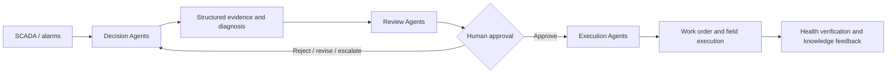

# WindOps Multi-Agent Platform

> AI-Native Multi-Agent Operations Platform for Wind Farms  
> 风电运维多智能体平台

WindOps 是一个可运行的海上风电智能运维 Web 演示。它把风场态势、SCADA 时序、工业告警、设备健康、Multi-Agent Mission、可解释决策、人工审批、工单执行和知识反馈串成一条可追踪的业务闭环。

首页不是聊天框，而是回答两个问题：**整个风场正在发生什么，以及 AI 正在处理什么。**

## 项目状态

> [!IMPORTANT]
> 本仓库包含两个边界清晰的运行形态：Cloudflare Sites 上的完整 Worker/D1 产品演示，以及 `backend/` 中面向 WT-023 的 Python 3.12 真实纵切。二者都使用合成领域数据，不是生产 SCADA 或自动控制系统，不得用于真实设备控制、安全判断或维护决策。

| 当前真实实现                                                                | 仍需生产集成的能力                                             |
| --------------------------------------------------------------------------- | -------------------------------------------------------------- |
| React 19 + TypeScript 严格模式的 10 个核心闭环页面与 11 个专业/平台工作区   | 真实 SCADA、CMS、气象、ERP/EAM 接入                            |
| vinext/Vite + Cloudflare Worker/Sites，D1 持久化 WT-023 演示闭环            | D1 备份恢复、跨区域治理、生产身份接入与持续事件总线            |
| Worker 混合读写 API、有限 SSE、模拟 WebSocket 与 17-tool 确定性运行时       | Worker 工具仍为确定性演示；不等同于 Python Agent 服务          |
| Python FastAPI/Pydantic/SQLAlchemy + LangGraph/LiteLLM 的 WT-023 后端纵切   | 扩展到 64 台资产及通用 Mission/工单，并完成真实遥测与 EAM 集成 |
| PostgreSQL/TimescaleDB/pgvector、Redis/Dramatiq、MinIO 的生产形态代码与迁移 | 真实依赖栈、模型供应商、备份、SLO 和发布环境的端到端验证       |
| Bearer RBAC、人工审批、事务 outbox、顺序现场任务与可校验的证据/哈希门禁     | 企业 SSO、集中式密钥管理、生产审批策略、安全审计与灾难演练     |

Cloudflare Sites 只托管 Worker/D1 演示，不托管 `backend/` Python 服务。Python 纵切已通过 SQLite 自动化测试与 PostgreSQL 离线迁移渲染；本地未启动 Docker、PostgreSQL、TimescaleDB、Redis、MinIO 或真实 LiteLLM，也未部署 Python 服务。

## 10 个核心闭环页面

|   # | 页面                      | 路由            | 重点                                                                   |
| --: | ------------------------- | --------------- | ---------------------------------------------------------------------- |
|  01 | Operations Command Center | `/`             | 全场 KPI、功率趋势、健康分布、高优告警、活跃 Mission 与 Agent Activity |
|  02 | Wind Farm Overview        | `/wind-farms`   | 64 台风机的卡片、列表、拓扑、筛选与详情 Drawer                         |
|  03 | Wind Turbine Detail       | `/turbines/:id` | 数字资产、子系统健康、SCADA、告警、Mission、维护与文档                 |
|  04 | SCADA Monitoring          | `/scada`        | 17 类实时预览时序、阈值、异常和 AI 事件联合监控                        |
|  05 | Alarm Center              | `/alarms`       | 工业告警表、分级筛选、详情 Drawer 与 AI Diagnosis                      |
|  06 | Agent Control Center      | `/agents`       | 22 个 Agent 的状态、三层组织、任务队列、工具与运行指标                 |
|  07 | Mission Center            | `/missions`     | 10 个活动 Mission 与 2 个已完成案例的任务看板                          |
|  08 | Mission Detail            | `/missions/:id` | 协作时间线、证据、决策、审批与执行准备度                               |
|  09 | Decision Center           | `/decisions`    | 三方案比较、推荐理由、风险权衡与人工审批                               |
|  10 | Work Order Center         | `/work-orders`  | 工单状态、5 项任务门禁、PPE、工具、备件与安全程序                      |

核心闭环之外还实现了 11 个可直接访问的专业/平台工作区：

| 页面                   | 路由                      | 能力                                                                                                  |
| ---------------------- | ------------------------- | ----------------------------------------------------------------------------------------------------- |
| Asset Health           | `/health`                 | 64 台机组健康矩阵、失效概率、RUL、子系统健康与闭环回写                                                |
| Predictive Maintenance | `/predictive-maintenance` | 风险排序、24H–90D 窗口、P×C 风险矩阵与 WT-023 预测故事                                                |
| Resource Center        | `/resources`              | 备件库存、班组、船舶、工具、天气窗与工单资源预留                                                      |
| Knowledge Base         | `/knowledge`              | 文档目录、D1 passage 正文检索、证据引用与闭环案例                                                     |
| Maintenance Plan       | `/maintenance`            | 维护日历/列表、天气与资源准备度、冲突检查和 WT-023 状态覆盖                                           |
| Report Center          | `/reports`                | 六类确定性报告、预览，以及有效 PDF/DOCX 文件导出                                                      |
| Digital Twin           | `/digital-twin`           | 64 台资产与 12 子系统的 2D 运行态示意、SCADA/告警/RUL 和工作流上下文；不声称物理仿真                  |
| Diagnosis Center       | `/diagnosis`              | 异常输入、差异诊断、支持/反证、下一步动作、来源引用与人工复核                                         |
| Data Center            | `/data`                   | 数据域目录、实时/归档/API/Schema 数据集、质量、新鲜度、保留期与查询                                   |
| Model Management       | `/models`                 | 确定性模型登记、版本、输入输出、指标和运行边界；不声称真实推理服务                                    |
| System Settings        | `/settings`               | 运行时、D1、WebSocket、身份、主题、数据策略和诊断状态；不显示密钥，状态只读且仅本机显示主题可真实生效 |

`/turbines/:id` 和 `/missions/:id` 都会按动态 ID 查询真实的确定性数据。`WT-023` 与 `MISSION-2026-0823` 展示完整主故事，其余合法 ID 展示对应资产或 Mission 的通用详情；未知 ID 进入应用的 `not-found` 页面。风机详情 API 对未知 ID 同样返回结构化 `404`。

## Screenshot


首页把全场 KPI、健康矩阵、告警态势、Agent 活动和 WT-023 主故事放在同一运营视图中。上图是仓库现有的静态预览，可能滞后于当前界面，不作为本轮视觉验收或生产部署证明。

## WT-023 可交互闭环

所有核心页面共享 `WT-023` 主轴承异常故事。主要证据包括：

| 信号                       |        基线 |                当前值 | 解释                         |
| -------------------------- | ----------: | --------------------: | ---------------------------- |
| Main Bearing Vibration RMS | `3.79 mm/s` | `4.81 mm/s`（`+27%`） | 超过 `4.5 mm/s` Warning 阈值 |
| Main Bearing Temperature   |    `68.0°C` |  `76.4°C`（`+8.4°C`） | 超过 `75°C` 阈值             |
| Multivariate Anomaly Score |      `0.18` |                `0.86` | 超过 `0.65` 告警阈值         |
| BPFO band energy           |           — |                `+19%` | 包络谱出现外圈故障特征边带   |

D1 服务器基线从“高风险方案待人工选择与审批、工单草稿”开始。Decision Center 的 A/B/C 选择会写入审批记录、状态摘要、幂等指纹和审计事件；批准后，所选方案还会确定工单标题、任务、工具与安全要求。用户可以从四种人工结果中选择并重放完整审批门禁：

- `approve`：Decision 进入 `approved`，Mission 回到 `executing`，工单进入 `scheduled`。
- `reject`：Decision 进入 `rejected`，Mission 回到 `decision-pending`，工单保持 `draft`。
- `request-revision`：Decision 进入 `revision-requested`，Mission 回到 `diagnosed`，工单保持 `draft`。
- `escalate`：Decision 与 Mission 保持 `under-review`，执行动作继续锁定。

只有获批且已排程的工单可以开始执行；只有 `in-progress` 工单可以提交现场任务证据；只有 5 项任务全部完成后，完成按钮才会解锁。Worker 演示为每项任务写入 `verificationMode: deterministic-fixture`、`fixture://` URI、SHA-256、measurement 和服务器规范化的 `verifiedBy`。这些字段用于演示可审计的数据结构，不代表 R2 对象存在（当前 Sites 配置的 `r2` 为 `null`）；真实对象存在性和哈希校验只在下述 Python/MinIO 生产路径实现。完成 `WO-20260823-017` 后：

- Mission 进入 `completed / 100%`，工单进入 `completed`；
- 风机健康度从 `68` 恢复到 `82`，主轴承健康度从 `63` 恢复到 `78`；
- verification 与 knowledge 两条事件写入服务器审计轨迹；
- 生成知识案例 `KB-CASE-2026-WT023-CLOSED`。

页面使用 Zustand 做乐观交互，但 D1 快照才是权威状态。每次变更都提交 `idempotencyKey`、`correlationId` 与 `expectedRevision`；任务使用显式 `set-task-completion(completed)`，避免重放 toggle 造成反向更新。Dashboard、Mission、Decision、Work Order、资产健康和 Knowledge 页面读取同一服务器快照，Topbar 会显示 `D1 · Rn / SAVING / OFFLINE`。告警确认与指派同样是 D1-only mutation，带幂等、CAS 和追加式审计；告警与 Agent WebSocket 每帧读取相同的 D1 overlay。写 API 只接受服务器维护的 Demo principal，并按动作限制审批、执行、复测与重置权限；响应明确标记 `authenticated: false`，这只是防止请求体任意改写审计身份，不是生产 SSO/RBAC。

> [!NOTE]
> 若 D1 binding 缺失，`GET /api/workflow/WT-023` 会返回明确的只读 ephemeral 基线，所有写操作返回 `503 PERSISTENCE_UNAVAILABLE`；客户端不会把 localStorage 冒充为成功持久化。

## 双运行架构

```mermaid
flowchart TB
  repo["WindOps repository"] --> demo["Sites Worker/D1 product demo"]
  repo --> slice["backend/ · Python 3.12 WT-023 vertical slice"]

  browser["Browser"] --> demo
  demo --> pages["vinext pages · ECharts · TanStack Query/Table · Zustand"]
  demo --> worker["Worker API · finite SSE · simulated WebSocket"]
  worker --> fixtures["Deterministic linked fixtures and archives"]
  worker --> workerTools["17-tool deterministic runtime"]
  worker --> d1["D1 workflow, passages, audit and AgentExecution ledger"]

  slice --> fastapi["FastAPI · Pydantic · SQLAlchemy async"]
  fastapi --> pg["PostgreSQL · TimescaleDB · pgvector"]
  fastapi --> outbox["Transactional outbox"]
  outbox --> queue["Redis · Dramatiq worker"]
  queue --> graph["LangGraph public-state orchestration"]
  graph --> llm["LiteLLM reasoning and embeddings"]
  graph --> pg
  fastapi --> minio["MinIO field evidence verification"]
```

这不是一个已经合并部署的单体系统。浏览器当前读取 Worker API，Sites 部署只包含 Worker/D1 产品演示；`backend/` 是可独立启动、可独立部署的 Python API/worker 纵切，前端尚未切换到它。Worker 侧的 17 个工具和 passage 检索保持确定性；Python 侧另有 11 个 SQL/计算/受控写工具、LangGraph 编排、LiteLLM 推理/embedding 适配器与 pgvector 检索，不能把两套运行时混称为同一实现。

页面和 Worker API 共享 `lib/` 中的规范化领域对象。SCADA、健康、预测、资源与知识工作台通过统一 API 客户端和 TanStack Query 读取 Worker API。WT-023 D1 状态会覆盖 Mission、Decision、Agent、告警、工单、风机健康、风场汇总和知识目录的对应 fixture，因此闭环状态在相关读 API 中保持同源。ECharts 可切换 `LIVE/1H/6H/24H/7D/30D` 六个不同采样窗口，24 小时窗口为 17 组、每组 97 点；逻辑 SCADA 归档按请求页即时生成，不在内存中一次性物化 131,072 行。

## 数据规模

快照时间固定在 `2026-08-13`（`Asia/Shanghai`）。

| 数据集            |                                      规模 | 说明                                                                             |
| ----------------- | ----------------------------------------: | -------------------------------------------------------------------------------- |
| 风场 / 风机       |                                  `1 / 64` | 总装机容量 `384 MW`                                                              |
| SCADA 实时预览    |                      `17 × 97 = 1,649` 点 | 含物理测点和多变量异常分数                                                       |
| SCADA 逻辑归档    |                              `131,072` 点 | `64 × 16 × 128`，15 分钟间隔，分页生成                                           |
| 告警              |                 archive `100` / live `19` | live 中 17 条未关闭；archive scope 总数包含 live 快照                            |
| 工单              | historical `30` / live `9` / dataset `39` | 历史与当前集合分开查询                                                           |
| 历史故障案例      |                                      `20` | 与历史工单保持有效引用                                                           |
| Mission / Agent   |                    `12（10 active） / 22` | 22 个 Agent 分为 Decision、Review、Execution 三层；Mission 另保留 2 个已完成案例 |
| WT-023 子系统健康 |                                      `12` | 包含主轴承、齿轮箱、发电机等                                                     |

物理 SCADA 归档有 16 个指标；实时预览额外包含模型输出的多变量异常分数，因此是 17 组。所有 ID、时间、数值、排序和跨实体引用都是确定性的，便于截图和回归测试。

## Worker API 与确定性数据接口

大部分遥测与目录 API 仍由确定性 fixture 驱动；WT-023 工作流、审计事件和 AgentExecution 使用 D1 持久化。

| Method | Endpoint                                   | 内容 / 查询契约                                                 |
| ------ | ------------------------------------------ | --------------------------------------------------------------- |
| `GET`  | `/api/wind-farms`                          | 风场集合与汇总指标                                              |
| `GET`  | `/api/turbines`                            | 64 台风机                                                       |
| `GET`  | `/api/turbines/:id`                        | 单台风机及关联 ID；未知 ID 返回 `404`                           |
| `GET`  | `/api/turbines/:id/scada`                  | 单机实时 SCADA 预览                                             |
| `GET`  | `/api/scada-history`                       | `LIVE/1H/6H/24H/7D/30D` 六个真实不同采样窗口                    |
| `GET`  | `/api/scada-measurements`                  | 归档分页；支持 `offset`、`limit`、`turbineId`、`metric`         |
| `GET`  | `/api/alarms?scope=live\|archive`          | 默认 `live`；分别返回 19 或 100 条                              |
| `GET`  | `/api/missions`                            | 12 个 Mission，其中 10 个处于活动阶段                           |
| `GET`  | `/api/agents`                              | 22 个 Agent（21 个规格角色 + Maintenance Strategy）             |
| `GET`  | `/api/decisions`                           | Decision 集合；叠加 WT-023 D1 审批状态与 workflow revision      |
| `GET`  | `/api/evidence`                            | 可追踪 Evidence 集合与当前 workflow persistence/revision 元数据 |
| `GET`  | `/api/work-orders?scope=live\|archive`     | 默认 `live`；分别返回 9 条当前工单或 30 条历史工单              |
| `GET`  | `/api/failure-cases`                       | 20 个历史故障闭环案例                                           |
| `GET`  | `/api/health-assessments`                  | 64 台机组健康、趋势、失效概率与 RUL                             |
| `GET`  | `/api/predictive-assessments`              | 可过滤、排序、分页的预测性维护快照                              |
| `GET`  | `/api/resources`                           | 备件、班组、船舶、工具与天气窗；支持工单过滤                    |
| `GET`  | `/api/knowledge-documents`                 | 文档检索、类型过滤、排序与分页                                  |
| `POST` | `/api/knowledge-assistant`                 | 对合法风机/Mission 做 passage 正文确定性检索，并返回可追踪引用  |
| `GET`  | `/api/maintenance-plans`                   | 维护计划检索、筛选、排序、分页与 WT-023 D1 状态覆盖             |
| `GET`  | `/api/reports`                             | 六类报告目录、检索、筛选与分页                                  |
| `GET`  | `/api/reports/:id`                         | 单份报告的完整预览数据                                          |
| `GET`  | `/api/reports/:id/export?format=pdf\|docx` | 生成并下载有效 PDF 或 DOCX 文件                                 |
| `GET`  | `/api/digital-twin`                        | 64 台资产的 12 子系统、SCADA、告警、RUL 与工作流上下文          |
| `GET`  | `/api/diagnoses`                           | 64 台资产的差异诊断、证据、反证、下一步动作与人工门禁           |
| `GET`  | `/api/data-catalog`                        | 数据域、数据集、质量、新鲜度、保留期与查询元数据                |
| `GET`  | `/api/model-registry`                      | 确定性模型与版本登记、I/O、指标和运行边界                       |
| `GET`  | `/api/system-status`                       | 无密钥的运行时、存储、实时通道、身份和数据策略状态              |
| `GET`  | `/api/health`                              | 完整性检查和分层数据计数                                        |
| `GET`  | `/api/agent-events`                        | 有限、可重放的 `text/event-stream` Agent 活动流                 |
| `GET`  | `/api/workflow/WT-023`                     | D1 权威工作流快照、revision、任务与不可变审计事件               |
| `POST` | `/api/workflow/WT-023`                     | 审批、显式任务更新、执行、完成与重置；带幂等和并发门禁          |

`/api/scada-measurements` 的 `offset` 默认为 `0`，`limit` 默认为 `100`、最大为 `1000`。过滤后的 `meta.total` 表示匹配总数，响应中的 `meta` 同时包含 `offset`、`limit`、标准化后的 `turbineId`、`metric` 和 `snapshotAt`。非法分页或 scope 返回结构化 `400`；不存在的 SCADA 过滤值返回空页。

集合响应遵循：

```json
{
  "data": [],
  "meta": {
    "count": 0,
    "total": 0,
    "snapshotAt": "2026-08-13T..."
  }
}
```

错误响应遵循 `{ "error": { "code": "...", "message": "..." } }`。SSE 按 `snapshot → agent-activity × N → complete` 发送有限事件后关闭。

同时提供三个 `windops.realtime.v1` 模拟 WebSocket 通道：`/ws/scada`、`/ws/alarms`、`/ws/agent-events`。Cloudflare WebSocket 运行时收到 Upgrade 后会发送 `hello` 与持续的确定性变化帧，支持 `ping → pong` 并在断连时清理定时器；普通 HTTP 或不支持 `WebSocketPair` 的本地 Node 运行时返回结构化 `426 WEBSOCKET_UPGRADE_REQUIRED`。这些通道用于演示客户端协议和实时 UI 接入，不是带持久化、重放游标或消息代理的生产事件总线。

`/api/health` 将数量分为三层：

```text
counts.live     当前 UI 快照：64 turbines、19 alarms（17 unresolved）、12 missions（10 active）、22 agents、9 work orders 等
counts.archive  131072 scadaMeasurements、100 alarms、30 historicalWorkOrders、20 failureCases
counts.dataset  64 turbines、131072 scadaMeasurements、100 alarms、39 workOrders、20 failureCases 等
```

### Worker Agent Tool Runtime

Worker 的确定性工具运行时暴露 17 个工具。以下 11 个是原始规格中的核心工具：

```text
get_turbine_status
query_scada
query_alarm_history
query_vibration
query_weather
query_maintenance_history
query_similar_failures
calculate_health_score
predict_rul
create_decision
create_work_order
```

为让 Agent 卡片声明与可调用目录保持一致，还实现了 `query_manual`、`query_work_orders`、`query_spare_parts`、`query_crew`、`query_vessels` 与 `update_work_order`。其中 `update_work_order` 与两个 `create_*` 工具一样，只生成严格校验、可审计的 dry-run 草稿，不修改浏览器状态或数据库。

| Method | Endpoint           | 行为                                           |
| ------ | ------------------ | ---------------------------------------------- |
| `GET`  | `/api/agent-tools` | 返回工具目录与 D1 执行账本；可按关联和状态过滤 |
| `POST` | `/api/agent-tools` | 校验上下文，执行工具并持久化 AgentExecution    |

示例：

```json
{
  "tool": "query_scada",
  "args": {
    "turbineId": "WT-023",
    "metric": "main-bearing-vibration-rms",
    "limit": 48
  },
  "agentId": "agent-scada-analysis",
  "missionId": "MISSION-2026-0823",
  "idempotencyKey": "mission-0823-scada-window-01"
}
```

每条执行记录包含 `executionId`、Agent/Mission 关联、`idempotencyKey`、`correlationId`、规范化输入、结构化结果、时间、状态、确定性延迟和 token 估算。默认请求要求 D1；无 binding 时返回 `503 AUDIT_PERSISTENCE_UNAVAILABLE`，只有显式 `persist:false` 才运行非持久的 runtime-memory 测试。

`create_decision`、`create_work_order` 与 `update_work_order` 是 **dry-run mutation**：它们只返回带 `persisted: false` 的草稿，不改变 Decision、审批、Mission 或工单数据，也不会调度现场动作。其他 14 个工具均为只读查询或确定性计算。该 Worker 运行时没有调用 LLM，也不是 LangGraph 执行器；不要与下述 Python 工具适配器混淆。

### Knowledge Assistant

知识助手从 D1 的 `knowledge_passages` 读取 passage 正文；没有 D1 binding 时使用内容相同的确定性 fixture 回退。检索先按风机/Mission 元数据限定可见范围，再只按查询词、领域短语和确定性 CJK n-gram 在 passage 正文中的命中次数评分，不调用 embedding、向量索引或 LLM。主轴承诊断必须同时满足问题意图和至少两项带 citation 的 finding；安全等其他问题不会借用 87% 主故事结论。每条 citation 都明确返回 `passageId`、`docId`、`page`、`section`、`quote`、`score` 与 `href`，finding 通过 passage/citation ID 关联证据；没有匹配证据时返回零置信度，不拼接臆测结论。响应持续标记 `realEmbedding: false`，并区分 `deterministic-d1-passage-retrieval` 与 fixture 回退模式。

## Python WT-023 后端纵切

`backend/` 是独立的 Python 3.12 服务，真实实现以下窄纵切：

```text
SCADA ingest → Alarm/Mission + transactional outbox → Redis/Dramatiq
→ LangGraph public-state analysis → Evidence/Decision → human approval
→ approval-gated Work Order + atomic resource reservation
→ five ordered, evidenced field tasks → health/alarm/mission closure → knowledge case
```

FastAPI 提供 `/api/v1` 路由，Pydantic 校验线协议，SQLAlchemy async 负责持久化。生产配置要求 PostgreSQL/asyncpg、TimescaleDB hypertable、pgvector `Vector(1536)` + HNSW cosine index、Redis/Dramatiq、MinIO 与 LiteLLM。四个 Alembic 迁移依次建立领域/时序/向量模型，Evidence/Decision/AgentExecution 审计字段，outbox/现场证据，以及 fencing lease、读访问审计和版本化 Agent/Skill/Tool 目录。

### Python 11-tool 真实语义

Python 工具目录恰好暴露 11 个工具。所有调用写入公开的 tool-call ledger；LangGraph 只保存可审计的输入引用、工具调用、结构化输出和指标，不保存或伪造隐藏 Chain-of-Thought。

| 工具                        | 真实行为与门禁                                                                                                                                  |
| --------------------------- | ----------------------------------------------------------------------------------------------------------------------------------------------- |
| `get_turbine_status`        | 从 SQL 读取风机状态、健康度及维护资源快照                                                                                                       |
| `query_scada`               | 按风机、变量、数量限制查询时序样本                                                                                                              |
| `query_alarm_history`       | 查询告警历史及结构化证据                                                                                                                        |
| `query_vibration`           | 从振动样本计算 RMS 趋势、异常分数与 BPFO 标记                                                                                                   |
| `query_weather`             | 查询风场天气窗及作业适宜性                                                                                                                      |
| `query_maintenance_history` | 查询该资产的持久化工单历史                                                                                                                      |
| `query_similar_failures`    | 生产 PostgreSQL 使用 LiteLLM embedding + pgvector/HNSW cosine 检索，并合并关系型闭环案例；SQLite 只在测试中使用明确标记的确定性 cosine provider |
| `calculate_health_score`    | 基于异常、振动趋势和数据质量计算版本化健康分，不直接回写资产                                                                                    |
| `predict_rul`               | 基于异常与趋势计算 RUL/30 天失效概率及模型版本                                                                                                  |
| `create_decision`           | 只为开放 Mission 持久化恰好三个方案的 `pending-approval` Decision，推荐项唯一，已终结 Decision 不可改写                                         |
| `create_work_order`         | 仅接受属于该 Mission 的有效人工批准；持久化工单与 5 项任务，并以 PostgreSQL 行锁/条件更新原子预留班组、船舶和备件                               |

### HITL、RBAC、outbox 与现场证据

除 `/healthz` 与 `/readyz` 外，每个业务读写路由都要求 `Authorization: Bearer <role-secret>`；读请求还会把服务器认定的 subject、role、endpoint 与 query 写入 `read_access_audits`。请求体中的 `approver`/`completed_by` 会被服务器认证主体覆盖。角色边界为：`scada_ingestor` 负责采集，`operations_approver` 批准或拒绝，`maintenance_reviewer` 退修，`operations_manager` 升级及受控参考数据导入，`field_technician` 完成现场任务。生产配置拒绝 SQLite、自动建表/演示 seed、确定性 reasoning、内联 outbox drain、非 TLS PostgreSQL/Redis/MinIO、空模型标识、非 HTTPS 的公开 MinIO 地址以及示例或重复弱密钥。

SCADA 请求先在一个事务中提交样本、Alarm、Mission 与 outbox event，再由 Redis/Dramatiq 分发 LangGraph 分析；模型或图执行失败不会回滚已接收遥测，并会在独立事务中保留失败的 AgentExecution/outbox 状态。worker 使用可恢复租约和 fencing token 处理重投递；过期 worker 无法提交图事务或覆盖较新的终态。测试环境才允许显式内联 drain。

5 项现场任务必须按顺序完成。每项都要求 `artifact_uri`、64 位 SHA-256、非空结构化 measurement，以及来自认证主体的 `verified_by`；生产只接受 `minio://bucket/object`，并校验对象存在性及元数据或实际内容哈希。只有恰好 5 条已验证任务证据存在后，系统才允许健康度 `68→82`、主轴承 `63→78`、Alarm/Mission 关闭与知识案例生成。

主要只读/写入端点包括 `POST /api/v1/scada/ingest`、`GET /api/v1/missions/{id}`（内含 Evidence、Decision、审批与 AgentExecution）、`POST /api/v1/missions/{id}/approvals`、`GET /api/v1/agent-executions`、`GET /api/v1/observability/agent-executions/24h`、`GET /api/v1/catalog`、`GET /api/v1/tools`、`GET /api/v1/work-orders/{id}`、`POST /api/v1/work-orders/{id}/tasks/{taskId}/complete`、受鉴权的知识正文/案例端点，以及风机 SCADA/健康端点。24 小时观测聚合返回成功/失败/running、平均值与 p95 延迟、工具/token、逐节点统计和去敏后的公开失败上下文。

## Drizzle 数据模型

`db/schema.ts` 已定义 35 张 SQLite/D1 表。除风场、风机、子系统、传感器、SCADA 测量、告警、健康评估、Agent、技能、工具、Mission、Mission Task、证据、Decision、审批、工单、维护记录、知识文档、故障案例、Agent Execution 和 Activity Event 外，还独立建模了资源库存、`knowledge_passages`、`workflow_instances`、`workflow_tasks`、`workflow_audit_events`、`workflow_idempotency`、`alarm_runtime_state` 与 `alarm_mutation_audit`。Schema 包含关键外键、唯一约束、索引、CHECK、关联 ID、时间戳和审计字段。

七个迁移组成连续的 Drizzle snapshot 链：`0000_windops_domain`、`0001_resource_inventory`、`0002_server_workflow`、`0003_agent_execution_indexes`、`0004_knowledge_passages`、`0005_workflow_field_evidence` 与 `0006_alarm_mutation_token`。最后两步增加任务/审计结构化证据、告警运行态与追加式告警审计，并用 mutation token 保护同毫秒并发写入。`.openai/hosting.json` 把逻辑 D1 binding 配置为 `DB`；空库用 prepared SQL 与 batch 初始化 WT-023 基线和确定性知识 passage。revision guard、审计 event sequence、CAS 与幂等响应共同保护并发写入和安全重放。

## 目录结构

```text
app/
  api/                         Worker API、Decision/Evidence、报告导出、有限 SSE 与工具路由
  turbines/[id]/               动态风机详情与 404 路由
  missions/[id]/               动态 Mission 详情与 404 路由
  maintenance/                 维护计划工作区
  reports/                     报告中心
  digital-twin/                2D 运行态数字孪生工作区
  diagnosis/                   差异诊断中心
  data/ models/ settings/      数据、模型与系统管理工作区
  loading.tsx                  全局加载状态
  error.tsx                    全局错误边界
  not-found.tsx                未知动态 ID 页面
components/
  charts/                      ECharts 时序组件
  data-display/                指标卡、状态、健康语义和表格组件
  layout/                      App Shell、Sidebar、Topbar、Command Palette
  pages/                       核心闭环与专业工作台页面
  providers/query-provider.tsx TanStack Query Provider
lib/
  api-client.ts                统一浏览器 API 客户端与结构化错误
  archive-data.ts              大规模确定性归档与按页生成器
  demo-workflow.ts             WT-023 合法状态迁移和完成门禁
  use-demo-workflow.ts         Zustand 乐观客户端 + D1 权威快照同步
  server-workflow-contract.ts  服务器状态机、revision 与审批/任务门禁
  agent-tool-runtime.ts        17 个工具、校验、dry-run 与可观测记录
  farm-data.ts                 风场与 64 台风机
  telemetry-data.ts            SCADA 预览、健康与天气窗口
  generic-subsystem-data.ts    64 台资产的 12 子系统确定性评估
  agent-data.ts                22 个 Agent 的三层组织
  operations-data.ts           告警、证据、Mission、Decision、工单与事件
  knowledge-data.ts            知识文档
  knowledge-passages.ts        可追踪的 passage 正文 fixture
  knowledge-assistant.ts       正文匹配、评分、finding 与 citation 组装
  health-data.ts               64 台机组健康评估
  resource-data.ts             备件、班组、船舶、工具与工单预留
  maintenance-plan-data.ts     维护日历、资源、天气与冲突模型
  report-data.ts               六类报告目录与预览模型
  report-export.ts             PDF/DOCX 文件生成器
  digital-twin-data.ts         2D 运行态资产孪生模型
  diagnosis-data.ts            差异诊断、证据和人工门禁模型
  platform-admin-data.ts       数据目录、模型登记与系统状态模型
  scada-history.ts             六个确定性监控时间窗
  realtime-stream.ts           三个 WebSocket 通道的公共变化帧
db/runtime-store.ts            D1 工作流事务、幂等与审计读取
db/agent-execution-store.ts    D1 AgentExecution 执行账本
db/knowledge-passage-store.ts  D1 passage 初始化、读取与 fixture 回退
db/schema.ts                   35 表 Drizzle Schema
drizzle/                       已生成的 SQLite/D1 迁移与元数据
worker/                        Cloudflare Worker 入口
tests/                         页面、API、迁移、检索、导出、工作流和工具运行时测试
backend/
  src/windops_backend/         FastAPI、LangGraph、SQL 工具、outbox、worker 与领域服务
  alembic/                     PostgreSQL/TimescaleDB/pgvector 与审计/outbox 迁移
  tests/                       SQLite 纵切、RBAC、工具、RAG、租约与失败审计测试
  docker-compose.yml           仅供本地的生产形态依赖栈
  example.env                  变量名称与不可部署的开发示例值
```

## 技术栈

| 范畴                  | 当前使用                                                                                          |
| --------------------- | ------------------------------------------------------------------------------------------------- |
| UI                    | React 19、TypeScript、Tailwind CSS 4、项目内 shadcn 风格 primitives、Lucide Icons                 |
| Worker Runtime/Build  | vinext、Vite 8、React Server Components、Cloudflare Worker/Sites                                  |
| Visualization         | Apache ECharts 6                                                                                  |
| Client State          | TanStack Query（SCADA、健康、预测、资源、知识、执行账本）、TanStack Table、Zustand 乐观闭环客户端 |
| Worker Data/Schema    | 确定性 TypeScript fixture、Drizzle ORM、SQLite/D1 七个迁移与 `DB` binding                         |
| Python API/Domain     | Python 3.12、FastAPI、Pydantic 2、SQLAlchemy asyncio、Alembic                                     |
| Agent/RAG             | LangGraph、LiteLLM、pgvector 1536 维 embedding 与 HNSW cosine 检索                                |
| Production-shape Data | PostgreSQL/asyncpg、TimescaleDB、Redis/Dramatiq、MinIO                                            |
| Quality               | TypeScript strict、ESLint、Prettier、Node test runner、pytest、Ruff、mypy、离线迁移渲染           |

## Getting Started

### 环境要求

- Node.js `>= 22.13.0`
- pnpm（建议通过 Corepack 管理）
- Python `3.12.x`（运行 `backend/` 时）
- Docker Compose（可选，仅用于启动 Python 服务依赖；不是生产部署方案）

### 本地运行 Worker 产品演示

```bash
corepack enable
pnpm install
pnpm dev
```

打开 `http://localhost:3000`。仓库使用 `pnpm-lock.yaml`，**不存在 `package-lock.json`**；请不要在同一变更中混用 npm 与 pnpm 锁文件。

### 质量检查

```bash
pnpm lint
pnpm typecheck
pnpm format:check
pnpm build
pnpm test
```

- `pnpm format` 使用 Prettier 写入格式，`pnpm format:check` 只检查。
- `pnpm test` 会先执行生产构建，再用 Node test runner 验证核心与 11 个专业/平台工作区、fixture API、归档分页与过滤、六个 SCADA 时间窗、12 子系统评估、维护计划、差异诊断、数字孪生、数据/模型/设置目录、PDF/DOCX 导出、D1 passage 初始化与引用、资源关联、WebSocket/D1 overlay、告警 mutation、A/B/C 决策、WT-023 状态机及 Agent Tool Runtime。当前门禁为 99/99。
- `pnpm db:generate` 可根据 Drizzle Schema 生成新迁移；运行时初始化不替代部署环境的正式迁移与备份策略。
- 本地生产构建可通过 `pnpm start` 启动。

### 本地运行 Python 纵切

以下命令在 PowerShell 中执行。先复制 `backend/example.env` 为 `.env`，再让本地 MinIO 凭据与 `docker-compose.yml` 保持一致；示例值不可用于生产。

```powershell
cd C:\coding\project\wind-agent\backend
py -3.12 -m venv .venv
.\.venv\Scripts\Activate.ps1
python -m pip install -e ".[test,dev]"
Copy-Item example.env .env
docker compose up -d
alembic upgrade head
windops-reference-import --reference-pack wt023
```

分别在独立终端启动 outbox relay、Dramatiq worker 和 API：

```powershell
windops-outbox-relay
dramatiq windops_backend.workers
uvicorn windops_backend.main:app --host 127.0.0.1 --port 8000
```

参考数据导入命令会安全提示输入 `operations_manager` 密钥，只导入风场、WT-023、知识文档、资源和天气窗，不会预生成 Alarm、Mission、Decision、Approval、Work Order 或 AgentExecution。

Python 质量门禁：

```powershell
python -m pytest tests -q
python -m ruff format --check src tests alembic
python -m ruff check src tests alembic
python -m mypy --no-incremental src
alembic upgrade head --sql
```

SQLite 仅用于自动化测试；它使用显式的确定性 embedding 与内存 artifact verifier。仓库当前已通过 Python 39/39 测试、Ruff、mypy、依赖完整性检查，以及 Alembic `0001→0004` PostgreSQL 离线迁移渲染，但尚未在本地对真实 PostgreSQL/TimescaleDB/pgvector、Redis/Dramatiq、MinIO 或 LiteLLM 做发布级集成测试。

## Multi-Agent Architecture

Worker 产品演示中的 22 个 Agent 按职责分为三层：其中 21 个对应规格命名角色，另增加 `Maintenance Strategy` 用于方案与成本风险权衡。它们声明的工具都来自 Worker 的 17-tool 确定性目录；Python WT-023 纵切则使用独立的 LangGraph 角色与 11-tool SQL 目录。

| 层级      | Agent                                                                                                                                                                                      | 职责                                                     |
| --------- | ------------------------------------------------------------------------------------------------------------------------------------------------------------------------------------------ | -------------------------------------------------------- |
| Decision  | Operations Coordinator、SCADA Analysis、Vibration Diagnosis、Structural Health、Electrical Diagnosis、Failure Diagnosis、Predictive Maintenance、Meteorological Risk、Maintenance Strategy | 发现异常、形成证据、诊断故障、预测风险并提出候选方案     |
| Review    | Safety Review、Engineering Review、Economic Review、Compliance、Resource Review                                                                                                            | 审核安全、工程可行性、经济性、合规性、天气与资源条件     |
| Execution | Work Order、Crew Scheduling、Spare Parts、Vessel Scheduling、Maintenance Execution、SCADA Control、Report、Knowledge                                                                       | 将批准决策转换为工单、资源计划、执行核验、报告与知识记录 |



界面和 Python API 只展示可公开、可审计的事件、证据、工具结果和决策摘要，**不展示也不伪造模型的隐藏 Chain-of-Thought**。Worker 知识问答对 D1 `knowledge_passages` 正文做确定性匹配和评分，并返回 passage 级来源引用及 `realEmbedding: false`。Python 代码提供 LangGraph、FastAPI、LiteLLM embedding/reasoning 与 pgvector 路径，但本仓库的本地验证没有调用真实模型服务。

## 诚实边界与 Roadmap

当前实现与生产系统之间仍有明确边界：

- Worker/Sites 是完整可交互的产品演示，但其 64 台资产、SCADA、告警、Agent 活动、知识 passage 和 17 个工具都来自确定性数据/逻辑；模拟 WebSocket 不是生产消息总线，dry-run 工具不会调度现场动作。
- Python 服务只实现 WT-023 单资产、单异常类型的纵切，不是 64 台资产的通用后端，也尚未连接当前 Worker 前端。
- PostgreSQL/TimescaleDB/pgvector、Redis/Dramatiq、MinIO 与 LiteLLM 的适配器、迁移、配置门禁和 Docker Compose 依赖清单已实现；本地没有启动这些容器、调用真实 LLM/embedding 服务或完成发布级集成测试。
- Python 服务没有部署；Cloudflare Sites 不能也不会托管该 Python API/worker。Sites 上线不应被解读为 Python 后端上线。
- 尚无 OPC UA/MQTT/IEC 数据接入、质量码与乱序处理、真实 CMS/气象/ERP/EAM、生产文档摄取或真实现场 artifact 流程。
- Python Bearer RBAC 是五个静态角色密钥与服务器主体映射，不是企业 SSO、细粒度 IAM 或完整密钥轮换方案；D1 Demo principal 同样不是生产认证。outbox 使用固定 5 分钟租约且没有 heartbeat，fencing 会阻止过期 worker 提交，但超长任务需要回滚并重试。
- 尚未完成生产 SLO、分布式追踪、备份恢复、灾难演练、渗透测试、完整 WCAG 或 Playwright 视觉回归。

下一阶段应先用真实 PostgreSQL/TimescaleDB/pgvector、Redis/Dramatiq、MinIO 与 LiteLLM 做集成/故障演练，再把 WT-023 状态机推广到通用 Mission/工单并接入真实遥测与 EAM，最后让前端通过受控网关消费 Python API。

## 许可证

WindOps 自有源码以 [MIT License](./LICENSE) 发布。第三方项目、依赖、名称和商标仍遵循各自许可证与权利边界；审计提交、许可证链接和 clean-room 声明见 [THIRD_PARTY_NOTICES.md](./THIRD_PARTY_NOTICES.md)。

## 开源参考与致谢

WindOps 以 clean-room 方式研究并重新实现通用产品模式：

| 项目                                                                                       | 审计提交                                   | 许可证               | 研究范围                                           |
| ------------------------------------------------------------------------------------------ | ------------------------------------------ | -------------------- | -------------------------------------------------- |
| [PyScada](https://github.com/pyscada/PyScada)                                              | `8e2fc499b7f216fc3c0c0407842d9e18838f71cb` | GNU AGPL v3 or later | SCADA 资产、变量、历史数据与告警领域组织           |
| [OpenClaw Mission Control](https://github.com/manish-raana/openclaw-mission-control)       | `fecdd3f285b7ece515526632f3ff46453b5a1c7c` | Apache License 2.0   | Agent、Mission、Task、Kanban 与活动时间线          |
| [NetBird Dashboard](https://github.com/netbirdio/dashboard)                                | `bbfa2d3a795220680df5398b824036f43004f084` | GNU AGPL v3          | 节点状态、资源列表、Drawer 与拓扑交互              |
| [next-shadcn-dashboard-starter](https://github.com/Kiranism/next-shadcn-dashboard-starter) | `5f42819faf6d797a768b1aa1a2cb8c579b77ab3b` | MIT                  | App Shell、Dashboard、卡片、表格、主题与响应式布局 |

[Grafana](https://github.com/grafana/grafana) 仅作为时序图、阈值、Tooltip、告警和 Dashboard Grid 的概念参考；本地参考集中没有 Grafana checkout，因此不声称审计或固定了本地提交。其默认项目许可证为 AGPL-3.0-only，并有上游记录的目录级例外。

这些项目仅用于领域信息架构、交互模式与视觉原则研究。WindOps 不是它们的 Fork，也不声称原创了这些通用模式。仓库中的业务代码、组件、样式、文案与模拟数据均为独立实现，**未复制、改编或合入 PyScada、NetBird、Grafana 等 AGPL 项目的源代码**。

完整的本地审计范围、提交、许可证链接与 clean-room 声明见 [THIRD_PARTY_NOTICES.md](./THIRD_PARTY_NOTICES.md)。项目名称及商标归各自权利人所有；列出参考项目不代表其作者或维护者为 WindOps 背书。
