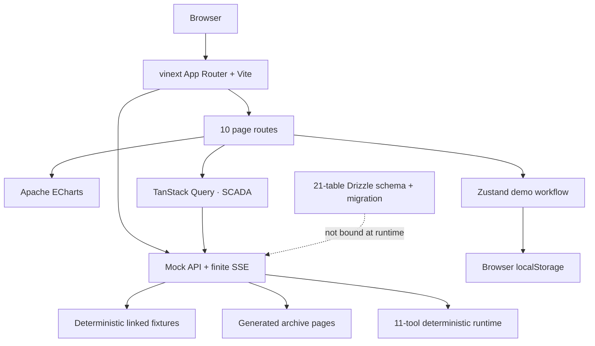
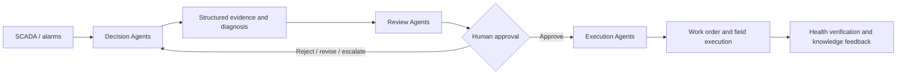

# WindOps Multi-Agent Platform

> AI-Native Multi-Agent Operations Platform for Wind Farms  
> 风电运维多智能体平台

WindOps 是一个可运行的海上风电智能运维 Web 演示。它把风场态势、SCADA 时序、工业告警、设备健康、Multi-Agent Mission、可解释决策、人工审批、工单执行和知识反馈串成一条可追踪的业务闭环。

首页不是聊天框，而是回答两个问题：**整个风场正在发生什么，以及 AI 正在处理什么。**

## 项目状态

> [!IMPORTANT]
> 本仓库是前端产品演示与领域原型，不是生产 SCADA、自动控制系统或已上线的 Agent 后端。所有风机、告警、气象、诊断、审批和执行数据均为确定性模拟数据，不得用于真实设备控制、安全判断或维护决策。

| 当前真实实现                                          | 尚未实现 / 生产目标                         |
| ----------------------------------------------------- | ------------------------------------------- |
| React 19 + TypeScript 严格模式的 10 个核心页面        | 真实 SCADA、CMS、气象、ERP/EAM 接入         |
| vinext / Vite 应用与 Cloudflare Worker/Sites 运行形态 | FastAPI 服务、后台任务与生产 WebSocket 总线 |
| 64 台风机与大规模、可重复生成的领域数据               | PostgreSQL、TimescaleDB 等生产数据存储      |
| 浏览器本地持久化的 WT-023 审批—执行—反馈闭环          | 服务端事务、RBAC、审批策略与不可变审计      |
| 只读快照 API、有限 SSE 和确定性 Agent Tool Runtime    | LangGraph / LLM 的真实 Agent 编排与模型调用 |
| 21 表 Drizzle Schema 与首个 SQLite/D1 迁移            | D1 运行时绑定、数据迁移、备份和恢复流程     |

## 10 个核心页面

|   # | 页面                      | 路由            | 重点                                                                   |
| --: | ------------------------- | --------------- | ---------------------------------------------------------------------- |
|  01 | Operations Command Center | `/`             | 全场 KPI、功率趋势、健康分布、高优告警、活跃 Mission 与 Agent Activity |
|  02 | Wind Farm Overview        | `/wind-farms`   | 64 台风机的卡片、列表、拓扑、筛选与详情 Drawer                         |
|  03 | Wind Turbine Detail       | `/turbines/:id` | 数字资产、子系统健康、SCADA、告警、Mission、维护与文档                 |
|  04 | SCADA Monitoring          | `/scada`        | 17 类实时预览时序、阈值、异常和 AI 事件联合监控                        |
|  05 | Alarm Center              | `/alarms`       | 工业告警表、分级筛选、详情 Drawer 与 AI Diagnosis                      |
|  06 | Agent Control Center      | `/agents`       | 15 个 Agent 的状态、三层组织、工具与运行指标                           |
|  07 | Mission Center            | `/missions`     | 10 个 Mission 从 Detected 到 Completed 的任务看板                      |
|  08 | Mission Detail            | `/missions/:id` | 协作时间线、证据、决策、审批与执行准备度                               |
|  09 | Decision Center           | `/decisions`    | 三方案比较、推荐理由、风险权衡与人工审批                               |
|  10 | Work Order Center         | `/work-orders`  | 工单状态、5 项任务门禁、PPE、工具、备件与安全程序                      |

`/turbines/:id` 和 `/missions/:id` 都会按动态 ID 查询真实的确定性数据。`WT-023` 与 `MISSION-2026-0823` 展示完整主故事，其余合法 ID 展示对应资产或 Mission 的通用详情；未知 ID 进入应用的 `not-found` 页面。风机详情 API 对未知 ID 同样返回结构化 `404`。

## WT-023 可交互闭环

所有核心页面共享 `WT-023` 主轴承异常故事。主要证据包括：

| 信号                       |        基线 |                当前值 | 解释                         |
| -------------------------- | ----------: | --------------------: | ---------------------------- |
| Main Bearing Vibration RMS | `3.79 mm/s` | `4.81 mm/s`（`+27%`） | 超过 `4.5 mm/s` Warning 阈值 |
| Main Bearing Temperature   |    `68.0°C` |  `76.4°C`（`+8.4°C`） | 超过 `75°C` 阈值             |
| Multivariate Anomaly Score |      `0.18` |                `0.86` | 超过 `0.65` 告警阈值         |
| BPFO band energy           |           — |                `+19%` | 包络谱出现外圈故障特征边带   |

规范快照从“方案 B 已批准、工单已排程”开始。用户可以重放审批门禁，再从四种人工结果中选择：

- `approve`：Decision 进入 `approved`，Mission 回到 `executing`，工单进入 `scheduled`。
- `reject`：Decision 进入 `rejected`，Mission 回到 `decision-pending`，工单保持 `draft`。
- `request-revision`：Decision 进入 `revision-requested`，Mission 回到 `diagnosed`，工单保持 `draft`。
- `escalate`：Decision 与 Mission 保持 `under-review`，执行动作继续锁定。

只有获批且已排程的工单可以开始执行；只有 `in-progress` 工单可以勾选现场任务；只有 5 项任务全部完成后，完成按钮才会解锁。完成 `WO-20260823-017` 后：

- Mission 进入 `completed / 100%`，工单进入 `completed`；
- 风机健康度从 `68` 恢复到 `82`，主轴承健康度从 `63` 恢复到 `78`；
- 验证事件和 Knowledge Agent 事件写入本地审计轨迹；
- 生成知识案例 `KB-CASE-2026-WT023-CLOSED`。

该状态由 Zustand 管理，并持久化到浏览器 `localStorage` 的 `windops-wt023-demo-v1`。Dashboard、Mission Center、Mission Detail、Decision Center、Work Order Center 和 WT-023 详情会读取同一份浏览器状态。

> [!NOTE]
> 这条交互闭环仅存在于当前浏览器。Mock API 始终返回规范化的确定性只读快照，不会接收或持久化 UI 审批、任务进度、健康恢复或知识案例；清理站点存储或重置演示会恢复规范状态。

## 当前架构



页面和 API 共享 `lib/` 中的规范化领域对象。SCADA 页面已通过统一 `apiGet` 客户端和 TanStack Query 读取 `/api/turbines/WT-023/scada`，并保留确定性初始快照和错误回退。WT-023 交互闭环使用 Zustand；其他领域页面仍主要直接消费同一套 fixture。

ECharts 展示 17 组、每组 97 点的 24 小时预览；逻辑 SCADA 归档按请求页即时生成，不在内存中一次性物化 131,072 行。

## 数据规模

快照时间固定在 `2026-08-13`（`Asia/Shanghai`）。

| 数据集            |                                      规模 | 说明                                        |
| ----------------- | ----------------------------------------: | ------------------------------------------- |
| 风场 / 风机       |                                  `1 / 64` | 总装机容量 `384 MW`                         |
| SCADA 实时预览    |                      `17 × 97 = 1,649` 点 | 含物理测点和多变量异常分数                  |
| SCADA 逻辑归档    |                              `131,072` 点 | `64 × 16 × 128`，15 分钟间隔，分页生成      |
| 告警              |                 archive `100` / live `14` | archive scope 总数包含 live 快照            |
| 工单              | historical `30` / live `9` / dataset `39` | 历史与当前集合分开查询                      |
| 历史故障案例      |                                      `20` | 与历史工单保持有效引用                      |
| Mission / Agent   |                                 `10 / 15` | Agent 分为 Decision、Review、Execution 三层 |
| WT-023 子系统健康 |                                      `12` | 包含主轴承、齿轮箱、发电机等                |

物理 SCADA 归档有 16 个指标；实时预览额外包含模型输出的多变量异常分数，因此是 17 组。所有 ID、时间、数值、排序和跨实体引用都是确定性的，便于截图和回归测试。

## Mock API

领域 API 是 fixture-backed、确定性且无持久化的演示接口。

| Method | Endpoint                               | 内容 / 查询契约                                         |
| ------ | -------------------------------------- | ------------------------------------------------------- |
| `GET`  | `/api/wind-farms`                      | 风场集合与汇总指标                                      |
| `GET`  | `/api/turbines`                        | 64 台风机                                               |
| `GET`  | `/api/turbines/:id`                    | 单台风机及关联 ID；未知 ID 返回 `404`                   |
| `GET`  | `/api/turbines/:id/scada`              | 单机实时 SCADA 预览                                     |
| `GET`  | `/api/scada-measurements`              | 归档分页；支持 `offset`、`limit`、`turbineId`、`metric` |
| `GET`  | `/api/alarms?scope=live\|archive`      | 默认 `live`；分别返回 14 或 100 条                      |
| `GET`  | `/api/missions`                        | 10 个 Mission                                           |
| `GET`  | `/api/agents`                          | 15 个 Agent                                             |
| `GET`  | `/api/work-orders?scope=live\|archive` | 默认 `live`；分别返回 9 条当前工单或 30 条历史工单      |
| `GET`  | `/api/failure-cases`                   | 20 个历史故障闭环案例                                   |
| `GET`  | `/api/health`                          | 完整性检查和分层数据计数                                |
| `GET`  | `/api/agent-events`                    | 有限、可重放的 `text/event-stream` Agent 活动流         |

`/api/scada-measurements` 的 `offset` 默认为 `0`，`limit` 默认为 `100`、最大为 `1000`。过滤后的 `meta.total` 表示匹配总数，响应中的 `meta` 同时包含 `offset`、`limit`、标准化后的 `turbineId`、`metric` 和 `snapshotAt`。非法分页或 scope 返回结构化 `400`；不存在的 SCADA 过滤值返回空页。

集合响应遵循：

```json
{
  "data": [],
  "meta": {
    "count": 0,
    "total": 0,
    "snapshotAt": "2026-08-13T..."
  }
}
```

错误响应遵循 `{ "error": { "code": "...", "message": "..." } }`。SSE 按 `snapshot → agent-activity × N → complete` 发送有限事件后关闭，不是持续连接的生产事件总线。

`/api/health` 将数量分为三层：

```text
counts.live     当前 UI 快照：64 turbines、14 alarms、10 missions、15 agents、9 work orders 等
counts.archive  131072 scadaMeasurements、100 alarms、30 historicalWorkOrders、20 failureCases
counts.dataset  64 turbines、131072 scadaMeasurements、100 alarms、39 workOrders、20 failureCases 等
```

### Agent Tool Runtime

确定性工具运行时暴露 11 个工具：

```text
get_turbine_status
query_scada
query_alarm_history
query_vibration
query_weather
query_maintenance_history
query_similar_failures
calculate_health_score
predict_rul
create_decision
create_work_order
```

| Method | Endpoint           | 行为                                           |
| ------ | ------------------ | ---------------------------------------------- |
| `GET`  | `/api/agent-tools` | 返回工具目录与当前进程内的执行历史             |
| `POST` | `/api/agent-tools` | 校验 `{ tool, args }` 并执行一次确定性工具调用 |

示例：

```json
{
  "tool": "query_scada",
  "args": {
    "turbineId": "WT-023",
    "metric": "main-bearing-vibration-rms",
    "limit": 48
  }
}
```

每条执行记录包含 `correlationId`、规范化输入、结构化结果、开始/结束时间、成功状态、确定性延迟和基于 UTF-8 字节的 token 估算。执行历史最多保留 100 条，只存在于当前 Worker/Node 进程，重启后清空。

`create_decision` 与 `create_work_order` 是 **dry-run mutation**：它们只返回带 `persisted: false` 的草稿，不改变 Decision、审批、Mission 或工单数据，也不会调度现场动作。其他 9 个工具均为只读查询或确定性计算。该运行时没有调用 LLM，也不是 LangGraph 执行器。

## Drizzle 数据模型

`db/schema.ts` 已定义 21 张 SQLite/D1 表：风场、风机、子系统、传感器、SCADA 测量、告警、健康评估、Agent、技能、工具、Mission、Mission Task、证据、Decision、审批、工单、维护记录、知识文档、故障案例、Agent Execution 和 Activity Event。Schema 包含关键外键、唯一约束、索引、关联 ID、时间戳和审计字段。

首个迁移已生成到 `drizzle/0000_windops_domain.sql`。但是 `.openai/hosting.json` 当前的 `d1` 与 `r2` 都是 `null`：运行时没有 D1 binding，也没有将 fixture 或浏览器状态写入数据库。Schema 和迁移是后续接入的准备，不应被理解为已经交付持久化后端。

## 目录结构

```text
app/
  api/                         Mock API、有限 SSE 与 Agent Tool Runtime 路由
  turbines/[id]/               动态风机详情与 404 路由
  missions/[id]/               动态 Mission 详情与 404 路由
  loading.tsx                  全局加载状态
  error.tsx                    全局错误边界
  not-found.tsx                未知动态 ID 页面
components/
  charts/                      ECharts 时序组件
  data-display/                指标卡、状态、健康语义和表格组件
  layout/                      App Shell、Sidebar、Topbar、Command Palette
  pages/                       10 个领域页面
  providers/query-provider.tsx TanStack Query Provider
lib/
  api-client.ts                统一浏览器 API 客户端与结构化错误
  archive-data.ts              大规模确定性归档与按页生成器
  demo-workflow.ts             WT-023 合法状态迁移和完成门禁
  use-demo-workflow.ts         Zustand + localStorage 状态层
  agent-tool-runtime.ts        11 个工具、校验、dry-run 与可观测记录
  farm-data.ts                 风场与 64 台风机
  telemetry-data.ts            SCADA 预览、健康与天气窗口
  agent-data.ts                三层 Agent 组织
  operations-data.ts           告警、证据、Mission、Decision、工单与事件
  knowledge-data.ts            知识文档
db/schema.ts                   21 表 Drizzle Schema
drizzle/                       已生成的 SQLite/D1 迁移与元数据
worker/                        Cloudflare Worker 入口
tests/                         构建产物、API、工作流和工具运行时测试
```

## 技术栈

| 范畴            | 当前使用                                                                          |
| --------------- | --------------------------------------------------------------------------------- |
| UI              | React 19、TypeScript、Tailwind CSS 4、项目内 shadcn 风格 primitives、Lucide Icons |
| Runtime / Build | vinext、Vite 8、React Server Components 工具链                                    |
| Visualization   | Apache ECharts 6                                                                  |
| Client State    | TanStack Query（SCADA）、Zustand（WT-023 演示闭环）                               |
| Data            | 类型安全的确定性 TypeScript fixture 与按页归档生成器                              |
| Schema          | Drizzle ORM、SQLite/D1 迁移（尚未绑定 D1）                                        |
| Hosting         | Cloudflare Worker runtime + Cloudflare Sites 集成                                 |
| Quality         | TypeScript strict、ESLint、Prettier、Node test runner、生产构建验证               |

## Getting Started

### 环境要求

- Node.js `>= 22.13.0`
- pnpm（建议通过 Corepack 管理）

### 本地运行

```bash
corepack enable
pnpm install
pnpm dev
```

打开 `http://localhost:3000`。仓库使用 `pnpm-lock.yaml`，**不存在 `package-lock.json`**；请不要在同一变更中混用 npm 与 pnpm 锁文件。

### 质量检查

```bash
pnpm lint
pnpm typecheck
pnpm format:check
pnpm build
pnpm test
```

- `pnpm format` 使用 Prettier 写入格式，`pnpm format:check` 只检查。
- `pnpm test` 会先执行生产构建，再用 Node test runner 验证 10 个页面、Mock API、归档分页与过滤、错误响应、SSE、WT-023 状态机及 Agent Tool Runtime。
- `pnpm db:generate` 可根据 Drizzle Schema 生成新迁移；在 D1 尚未绑定时，它不会创建或填充运行时数据库。
- 本地生产构建可通过 `pnpm start` 启动。

## Multi-Agent Architecture

15 个演示 Agent 按职责分为三层：

| 层级      | Agent                                                                                                                                             | 职责                                                 |
| --------- | ------------------------------------------------------------------------------------------------------------------------------------------------- | ---------------------------------------------------- |
| Decision  | Operations Coordinator、SCADA Analysis、Vibration Diagnosis、Failure Diagnosis、Predictive Maintenance、Meteorological Risk、Maintenance Strategy | 发现异常、形成证据、诊断故障、预测风险并提出候选方案 |
| Review    | Safety Review、Engineering Review、Economic Review、Resource Review                                                                               | 审核安全、工程可行性、经济性、天气与资源条件         |
| Execution | Work Order、Crew Scheduling、Vessel Scheduling、Knowledge                                                                                         | 将批准决策转换为工单、排班、船舶计划和知识记录       |



界面只展示可公开、可审计的事件、证据、工具结果和决策摘要，**不展示也不伪造模型的隐藏 Chain-of-Thought**。当前没有运行 LangGraph、FastAPI、RAG 或 LLM。

## 诚实边界与 Roadmap

当前演示不包含以下生产能力：

- OPC UA / MQTT / IEC 数据接入、质量码、乱序处理和持续流式总线；
- FastAPI、Pydantic、SQLAlchemy、后台任务或服务端事务；
- PostgreSQL、TimescaleDB、Redis、MinIO、pgvector 或实际 D1 持久化；
- LangGraph / LiteLLM 编排、真实 Tool Calling、模型推理或 RAG 文档摄取；
- SSO / RBAC、生产审批策略、不可变审计、密钥管理和安全沙箱；
- Playwright 视觉回归、完整 WCAG 审计、SLO、备份恢复和灾难演练。

下一阶段应优先把浏览器工作流迁移为服务端事务与不可变事件记录，再接入真实遥测和 EAM；随后才适合引入受控 Agent 编排、检索评测与生产可观测性。

## 开源参考与致谢

WindOps 以 clean-room 方式研究并重新实现通用产品模式：

| 项目                                                                                       | 审计提交                                   | 许可证               | 研究范围                                           |
| ------------------------------------------------------------------------------------------ | ------------------------------------------ | -------------------- | -------------------------------------------------- |
| [PyScada](https://github.com/pyscada/PyScada)                                              | `8e2fc499b7f216fc3c0c0407842d9e18838f71cb` | GNU AGPL v3 or later | SCADA 资产、变量、历史数据与告警领域组织           |
| [OpenClaw Mission Control](https://github.com/manish-raana/openclaw-mission-control)       | `fecdd3f285b7ece515526632f3ff46453b5a1c7c` | Apache License 2.0   | Agent、Mission、Task、Kanban 与活动时间线          |
| [NetBird Dashboard](https://github.com/netbirdio/dashboard)                                | `bbfa2d3a795220680df5398b824036f43004f084` | GNU AGPL v3          | 节点状态、资源列表、Drawer 与拓扑交互              |
| [next-shadcn-dashboard-starter](https://github.com/Kiranism/next-shadcn-dashboard-starter) | `5f42819faf6d797a768b1aa1a2cb8c579b77ab3b` | MIT                  | App Shell、Dashboard、卡片、表格、主题与响应式布局 |

[Grafana](https://github.com/grafana/grafana) 仅作为时序图、阈值、Tooltip、告警和 Dashboard Grid 的概念参考；本地参考集中没有 Grafana checkout，因此不声称审计或固定了本地提交。其默认项目许可证为 AGPL-3.0-only，并有上游记录的目录级例外。

这些项目仅用于领域信息架构、交互模式与视觉原则研究。WindOps 不是它们的 Fork，也不声称原创了这些通用模式。仓库中的业务代码、组件、样式、文案与模拟数据均为独立实现，**未复制、改编或合入 PyScada、NetBird、Grafana 等 AGPL 项目的源代码**。

完整的本地审计范围、提交、许可证链接与 clean-room 声明见 [THIRD_PARTY_NOTICES.md](./THIRD_PARTY_NOTICES.md)。项目名称及商标归各自权利人所有；列出参考项目不代表其作者或维护者为 WindOps 背书。
