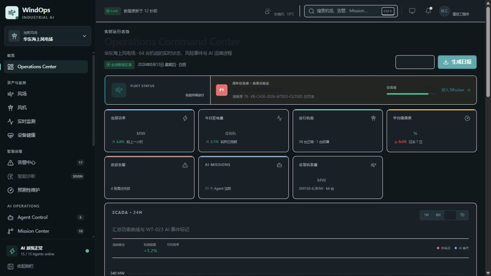
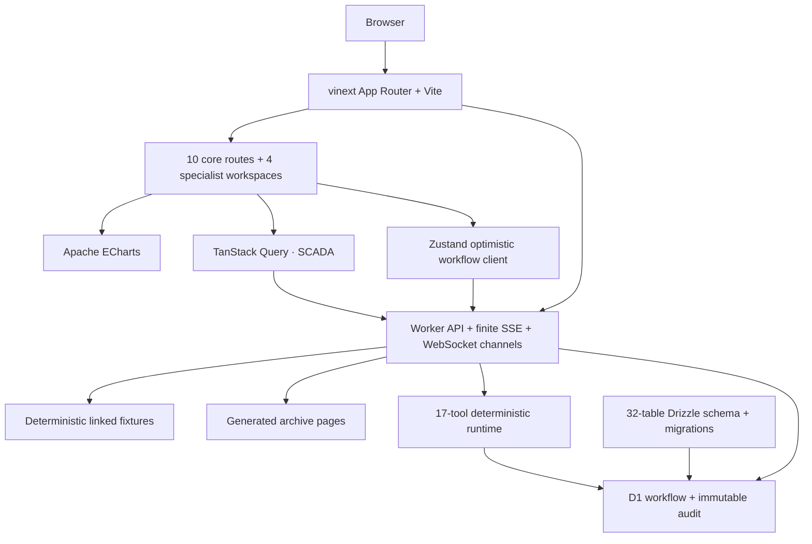
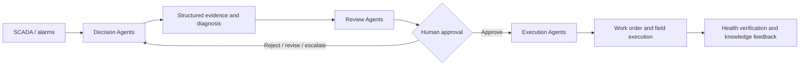

# WindOps Multi-Agent Platform

> AI-Native Multi-Agent Operations Platform for Wind Farms  
> 风电运维多智能体平台

WindOps 是一个可运行的海上风电智能运维 Web 演示。它把风场态势、SCADA 时序、工业告警、设备健康、Multi-Agent Mission、可解释决策、人工审批、工单执行和知识反馈串成一条可追踪的业务闭环。

首页不是聊天框，而是回答两个问题：**整个风场正在发生什么，以及 AI 正在处理什么。**

## 项目状态

> [!IMPORTANT]
> 本仓库是前端产品演示与领域原型，不是生产 SCADA、自动控制系统或已上线的 Agent 后端。所有风机、告警、气象、诊断、审批和执行数据均为确定性模拟数据，不得用于真实设备控制、安全判断或维护决策。

| 当前真实实现                                                        | 尚未实现 / 生产目标                         |
| ------------------------------------------------------------------- | ------------------------------------------- |
| React 19 + TypeScript 严格模式的 10 个核心闭环页面与 4 个专业工作台 | 真实 SCADA、CMS、气象、ERP/EAM 接入         |
| vinext / Vite 应用与 Cloudflare Worker/Sites 运行形态               | FastAPI 服务、后台任务与生产 WebSocket 总线 |
| 64 台风机与大规模、可重复生成的领域数据                             | PostgreSQL、TimescaleDB 等生产数据存储      |
| D1 持久化的 WT-023 审批—执行—反馈事务闭环与 revision 审计           | RBAC、生产审批策略、备份和恢复流程          |
| 混合读写 API、有限 SSE、WebSocket 与确定性 Agent Tool Runtime       | LangGraph / LLM 的真实 Agent 编排与模型调用 |
| 32 表 Drizzle Schema、四步迁移与 D1 运行时初始化                    | PostgreSQL / TimescaleDB 等生产数据平台     |

## 10 个核心闭环页面

|   # | 页面                      | 路由            | 重点                                                                   |
| --: | ------------------------- | --------------- | ---------------------------------------------------------------------- |
|  01 | Operations Command Center | `/`             | 全场 KPI、功率趋势、健康分布、高优告警、活跃 Mission 与 Agent Activity |
|  02 | Wind Farm Overview        | `/wind-farms`   | 64 台风机的卡片、列表、拓扑、筛选与详情 Drawer                         |
|  03 | Wind Turbine Detail       | `/turbines/:id` | 数字资产、子系统健康、SCADA、告警、Mission、维护与文档                 |
|  04 | SCADA Monitoring          | `/scada`        | 17 类实时预览时序、阈值、异常和 AI 事件联合监控                        |
|  05 | Alarm Center              | `/alarms`       | 工业告警表、分级筛选、详情 Drawer 与 AI Diagnosis                      |
|  06 | Agent Control Center      | `/agents`       | 15 个 Agent 的状态、三层组织、工具与运行指标                           |
|  07 | Mission Center            | `/missions`     | 10 个活动 Mission 与 2 个已完成案例的任务看板                          |
|  08 | Mission Detail            | `/missions/:id` | 协作时间线、证据、决策、审批与执行准备度                               |
|  09 | Decision Center           | `/decisions`    | 三方案比较、推荐理由、风险权衡与人工审批                               |
|  10 | Work Order Center         | `/work-orders`  | 工单状态、5 项任务门禁、PPE、工具、备件与安全程序                      |

核心闭环之外还实现了 4 个可直接访问的专业工作台：

| 页面                   | 路由                      | 能力                                                              |
| ---------------------- | ------------------------- | ----------------------------------------------------------------- |
| Asset Health           | `/health`                 | 64 台机组健康矩阵、失效概率、RUL、子系统健康与闭环回写            |
| Predictive Maintenance | `/predictive-maintenance` | 风险排序、24H–90D 窗口、P×C 风险矩阵与 WT-023 预测故事            |
| Resource Center        | `/resources`              | 备件库存、班组、船舶、工具、天气窗与工单资源预留                  |
| Knowledge Base         | `/knowledge`              | TanStack Table 文档目录、详情 Drawer 与带来源引用的确定性问答预览 |

`/turbines/:id` 和 `/missions/:id` 都会按动态 ID 查询真实的确定性数据。`WT-023` 与 `MISSION-2026-0823` 展示完整主故事，其余合法 ID 展示对应资产或 Mission 的通用详情；未知 ID 进入应用的 `not-found` 页面。风机详情 API 对未知 ID 同样返回结构化 `404`。

## Screenshot



首页把全场 KPI、健康矩阵、告警态势、Agent 活动和 WT-023 主故事放在同一运营视图中；截图来自本仓库的本地确定性快照。

## WT-023 可交互闭环

所有核心页面共享 `WT-023` 主轴承异常故事。主要证据包括：

| 信号                       |        基线 |                当前值 | 解释                         |
| -------------------------- | ----------: | --------------------: | ---------------------------- |
| Main Bearing Vibration RMS | `3.79 mm/s` | `4.81 mm/s`（`+27%`） | 超过 `4.5 mm/s` Warning 阈值 |
| Main Bearing Temperature   |    `68.0°C` |  `76.4°C`（`+8.4°C`） | 超过 `75°C` 阈值             |
| Multivariate Anomaly Score |      `0.18` |                `0.86` | 超过 `0.65` 告警阈值         |
| BPFO band energy           |           — |                `+19%` | 包络谱出现外圈故障特征边带   |

D1 服务器基线从“方案 B 待人工审批、工单草稿”开始。用户可以从四种人工结果中选择并重放完整审批门禁：

- `approve`：Decision 进入 `approved`，Mission 回到 `executing`，工单进入 `scheduled`。
- `reject`：Decision 进入 `rejected`，Mission 回到 `decision-pending`，工单保持 `draft`。
- `request-revision`：Decision 进入 `revision-requested`，Mission 回到 `diagnosed`，工单保持 `draft`。
- `escalate`：Decision 与 Mission 保持 `under-review`，执行动作继续锁定。

只有获批且已排程的工单可以开始执行；只有 `in-progress` 工单可以勾选现场任务；只有 5 项任务全部完成后，完成按钮才会解锁。完成 `WO-20260823-017` 后：

- Mission 进入 `completed / 100%`，工单进入 `completed`；
- 风机健康度从 `68` 恢复到 `82`，主轴承健康度从 `63` 恢复到 `78`；
- verification 与 knowledge 两条事件写入服务器审计轨迹；
- 生成知识案例 `KB-CASE-2026-WT023-CLOSED`。

页面使用 Zustand 做乐观交互，但 D1 快照才是权威状态。每次变更都提交 `idempotencyKey`、`correlationId` 与 `expectedRevision`；任务使用显式 `set-task-completion(completed)`，避免重放 toggle 造成反向更新。Dashboard、Mission、Decision、Work Order、资产健康和 Knowledge 页面读取同一服务器快照，Topbar 会显示 `D1 · Rn / SAVING / OFFLINE`。写 API 只接受服务器维护的四个 Demo principal，并按动作限制审批、执行、复测与重置权限；响应明确标记 `authenticated: false`，这只是防止请求体任意改写审计身份，不是生产 SSO/RBAC。

> [!NOTE]
> 若 D1 binding 缺失，`GET /api/workflow/WT-023` 会返回明确的只读 ephemeral 基线，所有写操作返回 `503 PERSISTENCE_UNAVAILABLE`；客户端不会把 localStorage 冒充为成功持久化。

## 当前架构



页面和 API 共享 `lib/` 中的规范化领域对象。SCADA、健康、预测、资源与知识工作台通过统一 API 客户端和 TanStack Query 读取 Worker API。WT-023 服务器状态会覆盖 Mission、工单、风机健康、风场汇总和知识目录的对应 fixture，因此闭环完成后所有相关读 API 保持同源。

ECharts 可切换 `LIVE/1H/6H/24H/7D/30D` 六个不同采样窗口，24 小时窗口为 17 组、每组 97 点；逻辑 SCADA 归档按请求页即时生成，不在内存中一次性物化 131,072 行。

## 数据规模

快照时间固定在 `2026-08-13`（`Asia/Shanghai`）。

| 数据集            |                                      规模 | 说明                                                               |
| ----------------- | ----------------------------------------: | ------------------------------------------------------------------ |
| 风场 / 风机       |                                  `1 / 64` | 总装机容量 `384 MW`                                                |
| SCADA 实时预览    |                      `17 × 97 = 1,649` 点 | 含物理测点和多变量异常分数                                         |
| SCADA 逻辑归档    |                              `131,072` 点 | `64 × 16 × 128`，15 分钟间隔，分页生成                             |
| 告警              |                 archive `100` / live `19` | live 中 17 条未关闭；archive scope 总数包含 live 快照              |
| 工单              | historical `30` / live `9` / dataset `39` | 历史与当前集合分开查询                                             |
| 历史故障案例      |                                      `20` | 与历史工单保持有效引用                                             |
| Mission / Agent   |                    `12（10 active） / 15` | Agent 分为 Decision、Review、Execution 三层；另保留 2 个已完成案例 |
| WT-023 子系统健康 |                                      `12` | 包含主轴承、齿轮箱、发电机等                                       |

物理 SCADA 归档有 16 个指标；实时预览额外包含模型输出的多变量异常分数，因此是 17 组。所有 ID、时间、数值、排序和跨实体引用都是确定性的，便于截图和回归测试。

## Worker API 与确定性数据接口

大部分遥测与目录 API 仍由确定性 fixture 驱动；WT-023 工作流、审计事件和 AgentExecution 使用 D1 持久化。

| Method | Endpoint                               | 内容 / 查询契约                                         |
| ------ | -------------------------------------- | ------------------------------------------------------- |
| `GET`  | `/api/wind-farms`                      | 风场集合与汇总指标                                      |
| `GET`  | `/api/turbines`                        | 64 台风机                                               |
| `GET`  | `/api/turbines/:id`                    | 单台风机及关联 ID；未知 ID 返回 `404`                   |
| `GET`  | `/api/turbines/:id/scada`              | 单机实时 SCADA 预览                                     |
| `GET`  | `/api/scada-history`                   | `LIVE/1H/6H/24H/7D/30D` 六个真实不同采样窗口            |
| `GET`  | `/api/scada-measurements`              | 归档分页；支持 `offset`、`limit`、`turbineId`、`metric` |
| `GET`  | `/api/alarms?scope=live\|archive`      | 默认 `live`；分别返回 19 或 100 条                      |
| `GET`  | `/api/missions`                        | 12 个 Mission，其中 10 个处于活动阶段                   |
| `GET`  | `/api/agents`                          | 15 个 Agent                                             |
| `GET`  | `/api/work-orders?scope=live\|archive` | 默认 `live`；分别返回 9 条当前工单或 30 条历史工单      |
| `GET`  | `/api/failure-cases`                   | 20 个历史故障闭环案例                                   |
| `GET`  | `/api/health-assessments`              | 64 台机组健康、趋势、失效概率与 RUL                     |
| `GET`  | `/api/predictive-assessments`          | 可过滤、排序、分页的预测性维护快照                      |
| `GET`  | `/api/resources`                       | 备件、班组、船舶、工具与天气窗；支持工单过滤            |
| `GET`  | `/api/knowledge-documents`             | 文档检索、类型过滤、排序与分页                          |
| `POST` | `/api/knowledge-assistant`             | WT-023 确定性检索问答与可点击来源引用                   |
| `GET`  | `/api/health`                          | 完整性检查和分层数据计数                                |
| `GET`  | `/api/agent-events`                    | 有限、可重放的 `text/event-stream` Agent 活动流         |
| `GET`  | `/api/workflow/WT-023`                 | D1 权威工作流快照、revision、任务与不可变审计事件       |
| `POST` | `/api/workflow/WT-023`                 | 审批、显式任务更新、执行、完成与重置；带幂等和并发门禁  |

`/api/scada-measurements` 的 `offset` 默认为 `0`，`limit` 默认为 `100`、最大为 `1000`。过滤后的 `meta.total` 表示匹配总数，响应中的 `meta` 同时包含 `offset`、`limit`、标准化后的 `turbineId`、`metric` 和 `snapshotAt`。非法分页或 scope 返回结构化 `400`；不存在的 SCADA 过滤值返回空页。

集合响应遵循：

```json
{
  "data": [],
  "meta": {
    "count": 0,
    "total": 0,
    "snapshotAt": "2026-08-13T..."
  }
}
```

错误响应遵循 `{ "error": { "code": "...", "message": "..." } }`。SSE 按 `snapshot → agent-activity × N → complete` 发送有限事件后关闭。

同时提供三个 `windops.realtime.v1` 模拟 WebSocket 通道：`/ws/scada`、`/ws/alarms`、`/ws/agent-events`。Cloudflare WebSocket 运行时收到 Upgrade 后会发送 `hello` 与持续的确定性变化帧，支持 `ping → pong` 并在断连时清理定时器；普通 HTTP 或不支持 `WebSocketPair` 的本地 Node 运行时返回结构化 `426 WEBSOCKET_UPGRADE_REQUIRED`。这些通道用于演示客户端协议和实时 UI 接入，不是带持久化、重放游标或消息代理的生产事件总线。

`/api/health` 将数量分为三层：

```text
counts.live     当前 UI 快照：64 turbines、19 alarms（17 unresolved）、12 missions（10 active）、15 agents、9 work orders 等
counts.archive  131072 scadaMeasurements、100 alarms、30 historicalWorkOrders、20 failureCases
counts.dataset  64 turbines、131072 scadaMeasurements、100 alarms、39 workOrders、20 failureCases 等
```

### Agent Tool Runtime

确定性工具运行时暴露 17 个工具。以下 11 个是原始规格中的核心工具：

```text
get_turbine_status
query_scada
query_alarm_history
query_vibration
query_weather
query_maintenance_history
query_similar_failures
calculate_health_score
predict_rul
create_decision
create_work_order
```

为让 Agent 卡片声明与可调用目录保持一致，还实现了 `query_manual`、`query_work_orders`、`query_spare_parts`、`query_crew`、`query_vessels` 与 `update_work_order`。其中 `update_work_order` 与两个 `create_*` 工具一样，只生成严格校验、可审计的 dry-run 草稿，不修改浏览器状态或数据库。

| Method | Endpoint           | 行为                                           |
| ------ | ------------------ | ---------------------------------------------- |
| `GET`  | `/api/agent-tools` | 返回工具目录与 D1 执行账本；可按关联和状态过滤 |
| `POST` | `/api/agent-tools` | 校验上下文，执行工具并持久化 AgentExecution    |

示例：

```json
{
  "tool": "query_scada",
  "args": {
    "turbineId": "WT-023",
    "metric": "main-bearing-vibration-rms",
    "limit": 48
  },
  "agentId": "agent-scada-analysis",
  "missionId": "MISSION-2026-0823",
  "idempotencyKey": "mission-0823-scada-window-01"
}
```

每条执行记录包含 `executionId`、Agent/Mission 关联、`idempotencyKey`、`correlationId`、规范化输入、结构化结果、时间、状态、确定性延迟和 token 估算。默认请求要求 D1；无 binding 时返回 `503 AUDIT_PERSISTENCE_UNAVAILABLE`，只有显式 `persist:false` 才运行非持久的 runtime-memory 测试。

`create_decision`、`create_work_order` 与 `update_work_order` 是 **dry-run mutation**：它们只返回带 `persisted: false` 的草稿，不改变 Decision、审批、Mission 或工单数据，也不会调度现场动作。其他 14 个工具均为只读查询或确定性计算。该运行时没有调用 LLM，也不是 LangGraph 执行器。

## Drizzle 数据模型

`db/schema.ts` 已定义 32 张 SQLite/D1 表。除风场、风机、子系统、传感器、SCADA 测量、告警、健康评估、Agent、技能、工具、Mission、Mission Task、证据、Decision、审批、工单、维护记录、知识文档、故障案例、Agent Execution 和 Activity Event 外，还独立建模了资源库存以及 `workflow_instances`、`workflow_tasks`、`workflow_audit_events`、`workflow_idempotency`。Schema 包含关键外键、唯一约束、索引、CHECK、关联 ID、时间戳和审计字段。

基础迁移位于 `drizzle/0000_windops_domain.sql`，资源迁移位于 `drizzle/0001_resource_inventory.sql`，服务器闭环迁移位于 `drizzle/0002_server_workflow.sql`，AgentExecution 查询与 correlation 唯一索引迁移位于 `drizzle/0003_agent_execution_indexes.sql`。`.openai/hosting.json` 把逻辑 D1 binding 配置为 `DB`；空库用逐条 prepared SQL 与 batch 初始化 WT-023 基线。revision guard、审计 event sequence 与幂等响应共同保护并发写入和安全重放。

## 目录结构

```text
app/
  api/                         Worker API、有限 SSE 与 Agent Tool Runtime 路由
  turbines/[id]/               动态风机详情与 404 路由
  missions/[id]/               动态 Mission 详情与 404 路由
  loading.tsx                  全局加载状态
  error.tsx                    全局错误边界
  not-found.tsx                未知动态 ID 页面
components/
  charts/                      ECharts 时序组件
  data-display/                指标卡、状态、健康语义和表格组件
  layout/                      App Shell、Sidebar、Topbar、Command Palette
  pages/                       核心闭环与专业工作台页面
  providers/query-provider.tsx TanStack Query Provider
lib/
  api-client.ts                统一浏览器 API 客户端与结构化错误
  archive-data.ts              大规模确定性归档与按页生成器
  demo-workflow.ts             WT-023 合法状态迁移和完成门禁
  use-demo-workflow.ts         Zustand 乐观客户端 + D1 权威快照同步
  server-workflow-contract.ts  服务器状态机、revision 与审批/任务门禁
  agent-tool-runtime.ts        17 个工具、校验、dry-run 与可观测记录
  farm-data.ts                 风场与 64 台风机
  telemetry-data.ts            SCADA 预览、健康与天气窗口
  agent-data.ts                三层 Agent 组织
  operations-data.ts           告警、证据、Mission、Decision、工单与事件
  knowledge-data.ts            知识文档
  health-data.ts               64 台机组健康评估
  resource-data.ts             备件、班组、船舶、工具与工单预留
  scada-history.ts             六个确定性监控时间窗
  realtime-stream.ts           三个 WebSocket 通道的公共变化帧
db/runtime-store.ts            D1 工作流事务、幂等与审计读取
db/agent-execution-store.ts    D1 AgentExecution 执行账本
db/schema.ts                   32 表 Drizzle Schema
drizzle/                       已生成的 SQLite/D1 迁移与元数据
worker/                        Cloudflare Worker 入口
tests/                         构建产物、API、工作流和工具运行时测试
```

## 技术栈

| 范畴            | 当前使用                                                                                          |
| --------------- | ------------------------------------------------------------------------------------------------- |
| UI              | React 19、TypeScript、Tailwind CSS 4、项目内 shadcn 风格 primitives、Lucide Icons                 |
| Runtime / Build | vinext、Vite 8、React Server Components 工具链                                                    |
| Visualization   | Apache ECharts 6                                                                                  |
| Client State    | TanStack Query（SCADA、健康、预测、资源、知识、执行账本）、TanStack Table、Zustand 乐观闭环客户端 |
| Data            | 类型安全的确定性 TypeScript fixture 与按页归档生成器                                              |
| Schema          | Drizzle ORM、SQLite/D1 四步迁移、运行时 `DB` binding 与安全初始化                                 |
| Hosting         | Cloudflare Worker runtime + Cloudflare Sites 集成                                                 |
| Quality         | TypeScript strict、ESLint、Prettier、Node test runner、生产构建验证                               |

## Getting Started

### 环境要求

- Node.js `>= 22.13.0`
- pnpm（建议通过 Corepack 管理）

### 本地运行

```bash
corepack enable
pnpm install
pnpm dev
```

打开 `http://localhost:3000`。仓库使用 `pnpm-lock.yaml`，**不存在 `package-lock.json`**；请不要在同一变更中混用 npm 与 pnpm 锁文件。

### 质量检查

```bash
pnpm lint
pnpm typecheck
pnpm format:check
pnpm build
pnpm test
```

- `pnpm format` 使用 Prettier 写入格式，`pnpm format:check` 只检查。
- `pnpm test` 会先执行生产构建，再用 Node test runner 验证核心与专业页面、fixture API、归档分页与过滤、六个 SCADA 时间窗、知识引用、资源关联、WebSocket 回退契约、SSE、WT-023 状态机及 Agent Tool Runtime。
- `pnpm db:generate` 可根据 Drizzle Schema 生成新迁移；运行时初始化不替代部署环境的正式迁移与备份策略。
- 本地生产构建可通过 `pnpm start` 启动。

## Multi-Agent Architecture

15 个演示 Agent 按职责分为三层：

| 层级      | Agent                                                                                                                                             | 职责                                                 |
| --------- | ------------------------------------------------------------------------------------------------------------------------------------------------- | ---------------------------------------------------- |
| Decision  | Operations Coordinator、SCADA Analysis、Vibration Diagnosis、Failure Diagnosis、Predictive Maintenance、Meteorological Risk、Maintenance Strategy | 发现异常、形成证据、诊断故障、预测风险并提出候选方案 |
| Review    | Safety Review、Engineering Review、Economic Review、Resource Review                                                                               | 审核安全、工程可行性、经济性、天气与资源条件         |
| Execution | Work Order、Crew Scheduling、Vessel Scheduling、Knowledge                                                                                         | 将批准决策转换为工单、排班、船舶计划和知识记录       |



界面只展示可公开、可审计的事件、证据、工具结果和决策摘要，**不展示也不伪造模型的隐藏 Chain-of-Thought**。知识问答是带来源引用的确定性关键词检索预览，并明确返回 `realEmbedding: false`；当前没有运行 LangGraph、FastAPI、向量数据库或 LLM。

## 诚实边界与 Roadmap

当前演示不包含以下生产能力：

- OPC UA / MQTT / IEC 数据接入、质量码、乱序处理和持续流式总线；
- FastAPI、Pydantic、SQLAlchemy 或后台任务；当前服务端事务仅覆盖 WT-023 主闭环；
- PostgreSQL、TimescaleDB、Redis、MinIO、pgvector，以及 D1 备份恢复/跨区域生产治理；
- LangGraph / LiteLLM 编排、真实 Tool Calling、模型推理或 RAG 文档摄取；
- SSO / RBAC、生产审批策略、不可变审计、密钥管理和安全沙箱；
- Playwright 视觉回归、完整 WCAG 审计、SLO、备份恢复和灾难演练。

下一阶段应把当前 WT-023 D1 状态机推广到通用 Mission/工单，并接入真实遥测和 EAM；随后才适合引入受控 Agent 编排、检索评测与生产可观测性。

## 开源参考与致谢

WindOps 以 clean-room 方式研究并重新实现通用产品模式：

| 项目                                                                                       | 审计提交                                   | 许可证               | 研究范围                                           |
| ------------------------------------------------------------------------------------------ | ------------------------------------------ | -------------------- | -------------------------------------------------- |
| [PyScada](https://github.com/pyscada/PyScada)                                              | `8e2fc499b7f216fc3c0c0407842d9e18838f71cb` | GNU AGPL v3 or later | SCADA 资产、变量、历史数据与告警领域组织           |
| [OpenClaw Mission Control](https://github.com/manish-raana/openclaw-mission-control)       | `fecdd3f285b7ece515526632f3ff46453b5a1c7c` | Apache License 2.0   | Agent、Mission、Task、Kanban 与活动时间线          |
| [NetBird Dashboard](https://github.com/netbirdio/dashboard)                                | `bbfa2d3a795220680df5398b824036f43004f084` | GNU AGPL v3          | 节点状态、资源列表、Drawer 与拓扑交互              |
| [next-shadcn-dashboard-starter](https://github.com/Kiranism/next-shadcn-dashboard-starter) | `5f42819faf6d797a768b1aa1a2cb8c579b77ab3b` | MIT                  | App Shell、Dashboard、卡片、表格、主题与响应式布局 |

[Grafana](https://github.com/grafana/grafana) 仅作为时序图、阈值、Tooltip、告警和 Dashboard Grid 的概念参考；本地参考集中没有 Grafana checkout，因此不声称审计或固定了本地提交。其默认项目许可证为 AGPL-3.0-only，并有上游记录的目录级例外。

这些项目仅用于领域信息架构、交互模式与视觉原则研究。WindOps 不是它们的 Fork，也不声称原创了这些通用模式。仓库中的业务代码、组件、样式、文案与模拟数据均为独立实现，**未复制、改编或合入 PyScada、NetBird、Grafana 等 AGPL 项目的源代码**。

完整的本地审计范围、提交、许可证链接与 clean-room 声明见 [THIRD_PARTY_NOTICES.md](./THIRD_PARTY_NOTICES.md)。项目名称及商标归各自权利人所有；列出参考项目不代表其作者或维护者为 WindOps 背书。
