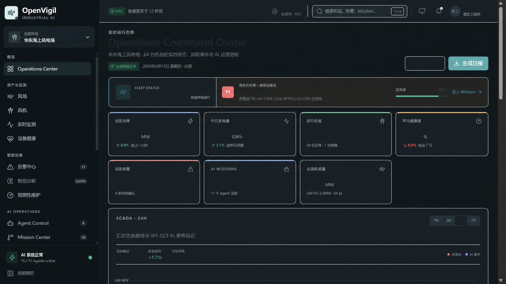

<p align="center">
  
</p>

<h1 align="center">OpenVigil</h1>
<p align="center"><b>风电智能运维多智能体平台</b><br>把监测、诊断、人工决策与现场执行连接成可审计的业务闭环。</p>

<p align="center">
  
  
  
  
</p>

<p align="center">
  <a href="#安装">安装</a> ·
  <a href="#快速开始">快速开始</a> ·
  <a href="#功能">功能</a> ·
  <a href="#系统架构">系统架构</a> ·
  <a href="#模型配置">模型配置</a> ·
  <a href="#开发">开发</a> ·
  <a href="#许可证">许可证</a>
</p>

---

<p align="center">
  
</p>

> _风电运维信息通常分散在资产、SCADA、告警、模型、人员审批、工单和现场证据中。真正困难的不是再做一个聊天框，而是让每一步判断都有来源、每一次决策都有人负责、每一项执行都能被复核。_
>
> _OpenVigil 将“监测 → 告警 → Mission → 诊断 → 人工决策 → 工单 → 现场证据 → 健康复核 → 知识回写”连接成一条可追踪、可恢复、受权限约束的闭环。AI 负责组织证据和提出方案，高风险授权仍由人完成。_

## 项目状态

> [!IMPORTANT]
> OpenVigil 当前是**生产候选实现**，不是已经上线的生产系统。默认 `demo` 模式用于确定性产品演示；`production` 模式连接独立部署的 Python 权威后端，并在身份、配置、依赖或 API 不满足要求时失败关闭。真实风场接入、现场系统、模型供应商和发布环境仍需联合验收。

产品统一定位为“风电智能运维平台”。登录页图片与 Demo 风场只代表展示场景，不限定业务范围，也不构成现场接入或生产验收证据。

## 安装

### 环境要求

- Node.js `>= 22.13.0`
- pnpm `11.21.0`，建议通过 Corepack 管理
- Python `3.12.x`，仅运行 `backend/` 时需要
- Docker Compose，可选，用于启动本地 Python 依赖栈

### 获取代码

```bash
git clone --recurse-submodules https://github.com/DAT4RIAN/OpenVigil.git
cd OpenVigil

corepack enable
pnpm install --frozen-lockfile
```

仓库使用 `pnpm-lock.yaml`。不要生成或提交 `package-lock.json`，也不要在同一变更中混用 npm 与 pnpm 锁文件。

## 快速开始

### 产品演示

```bash
pnpm dev
```

打开 `http://localhost:3000`。默认 Demo 提供 64 台确定性风机资产、WT-023 主轴承异常故事、D1 工作流状态、有限 SSE、模拟 WebSocket 和 17-tool Agent 运行时，适合产品演示、截图和回归验证。

### 生产构建

```bash
pnpm build
pnpm start
```

`pnpm start` 启动与发布一致的构建产物。默认仍运行 Demo；切换生产模式需要在部署环境中配置 Sites Worker、Python 后端地址、委托身份、批准的 release ID 与镜像摘要。未迁移路由不会回退到 fixture。

### Python 后端纵切

以下命令在 Windows PowerShell 中执行。根目录 `.env` 是唯一的本地配置文件；仅在它不存在时从 `.env.example` 创建。

```powershell
if (-not (Test-Path .env)) { Copy-Item .env.example .env }

cd backend
py -3.12 -m venv .venv
.\.venv\Scripts\Activate.ps1
python -m pip install -e ".[test,dev]"

docker compose up -d
alembic upgrade head
windops-reference-import --reference-pack wt023
```

参考数据导入会提示输入 `operations_manager` 密钥。随后可在三个独立终端启动 outbox relay、Dramatiq worker 和 API：

```powershell
windops-outbox-relay
dramatiq windops_backend.workers
uvicorn windops_backend.main:app --host 127.0.0.1 --port 8000
```

## 功能

### 运营指挥中心

首页把全场 KPI、健康矩阵、功率趋势、高优告警、活跃 Mission 和 Agent Activity 放在同一视图中，回答两个问题：**整个风场正在发生什么，以及 AI 正在处理什么。**

### 运维闭环

```text
SCADA / CMS / 气象 / 人工告警
              │
              ▼
       Alarm → Mission
              │
              ▼
   多 Agent 证据组织与差异诊断
              │
              ▼
      候选方案与人工审批
              │
              ▼
   Work Order → 顺序化现场任务
              │
              ▼
     健康复核 → 知识案例回写
```

WT-023 演示故事覆盖从主轴承振动与温度异常，到 Mission、诊断、方案比较、审批、工单、5 项现场任务、健康恢复和知识沉淀的完整路径。所有写入都带幂等键、关联 ID、期望 revision 和追加式审计事件。

### 业务工作区

| 工作区                    | 路由                                 | 主要能力                                           |
| ------------------------- | ------------------------------------ | -------------------------------------------------- |
| Operations Command Center | `/`                                  | 全场态势、风险对象、Mission 与 Agent 活动          |
| Wind Farm / Turbine       | `/wind-farms`、`/turbines/:id`       | 资产拓扑、健康、SCADA、告警和维护上下文            |
| SCADA / Alarm             | `/scada`、`/alarms`                  | 时序监测、阈值、质量码、异常和处置状态             |
| Agent / Mission           | `/agents`、`/missions`               | Agent 组织、任务队列、证据、协作时间线和审批准备度 |
| Decision / Work Order     | `/decisions`、`/work-orders`         | 方案比较、人工审批、任务门禁和现场证据             |
| Health / Predictive       | `/health`、`/predictive-maintenance` | 健康矩阵、风险排序、RUL 展示和维护窗口             |
| Resource / Maintenance    | `/resources`、`/maintenance`         | 班组、备件、工具、天气窗、日历和冲突检查           |
| Knowledge / Reports       | `/knowledge`、`/reports`             | 证据检索、知识案例、报告预览与 PDF/DOCX 导出       |
| Data / Models / Diagnosis | `/data`、`/models`、`/diagnosis`     | 数据治理、CARE 评估、模型门禁和诊断溯源            |
| Digital Twin / Settings   | `/digital-twin`、`/settings`         | 2D 运行态示意、运行时、身份与数据策略状态          |

数字孪生页面用于运行态上下文展示，不宣称物理仿真、实时控制或工程级三维模型。

### 多智能体协作

Demo 中的 22 个 Agent 分为三层：

| 层级      | 代表角色                                                                          | 职责                                   |
| --------- | --------------------------------------------------------------------------------- | -------------------------------------- |
| Decision  | SCADA Analysis、Vibration Diagnosis、Predictive Maintenance、Maintenance Strategy | 发现异常、组织证据、形成诊断和候选方案 |
| Review    | Safety、Engineering、Economic、Compliance、Resource Review                        | 复核安全、工程、经济、合规和资源条件   |
| Execution | Work Order、Crew、Spare Parts、Maintenance、Report、Knowledge                     | 把获批决策转换为受控执行与反馈         |

Python 后端使用独立的 LangGraph 工作流和 11-tool SQL 目录。界面与 API 只展示公开、结构化、可审计的依据，不展示或伪造模型隐藏的 Chain-of-Thought。

### CARE v6 基准

CARE v6 是独立的离线异常检测与受治理评估路径。原始数据不进入仓库，运行者必须从获授权的只读位置显式提供数据源。

| 项目     | 当前实现                                                               |
| -------- | ---------------------------------------------------------------------- |
| 数据合同 | 95 个事件、36 个场内资产、5,242,948 行；A → C → B 固定导入顺序         |
| 质量处理 | 原值不改写，异常质量进入独立 mask；真值在预测冻结后才对 evaluator 开放 |
| 存储     | 全信号写入分区宽表 Parquet；只把选定的有界回放窗口写入在线时序库       |
| 评估     | 场内留一资产协议，覆盖 36 fold、95 events 和 281,249 prediction points |
| 治理     | 数据集、制品、模型、评估、回放和导出都绑定不可变身份、摘要与权限       |
| 边界     | 当前结果不支持跨风场泛化、真实 RUL、30 天故障概率或现场安全结论        |

CARE 数据集及受其许可证约束的派生分发制品遵循 CC BY-SA 4.0；OpenVigil 自有源码的 Apache License 2.0 不覆盖这些数据资产。

### API 与实时数据

| 接口                                          | 用途                                     |
| --------------------------------------------- | ---------------------------------------- |
| `/api/runtime`                                | 当前运行模式、后端就绪状态与脱敏发布身份 |
| `/api/workflow/:assetId`                      | Demo 工作流快照、审批、工单和审计状态    |
| `/api/backend/:path+`                         | 生产模式下受允许列表约束的 FastAPI 网关  |
| `/api/v1/events/stream`                       | 生产 SSE，支持游标续传和有界重连         |
| `/ws/scada`、`/ws/alarms`、`/ws/agent-events` | Demo 模拟实时通道；生产模式失败关闭      |

生产请求由 Sites Worker 为每个用户签发短期委托令牌，并绑定 method、target、body digest 和唯一 `jti`。浏览器不会直接访问 PostgreSQL、Redis、MinIO 或 Neo4j。

## 系统架构

```text
Browser
   │
   ▼
vinext / React 19 application
   │
   ├── Demo
   │     └── Cloudflare Worker + D1
   │           ├── deterministic fixtures
   │           ├── workflow / audit state
   │           └── finite SSE + simulated WebSocket
   │
   └── Production
         └── Sites identity gateway
               │  delegated JWT / allowlist / release verification
               ▼
             FastAPI
               ├── PostgreSQL / TimescaleDB / pgvector
               ├── Redis / Dramatiq / durable outbox
               ├── MinIO governed artifacts
               ├── Neo4j derived knowledge graph
               ├── LiteLLM reasoning and embeddings
               └── SCADA / MQTT / HTTPS / EAM connectors
```

Demo D1 与生产 PostgreSQL 是两个独立边界，不做隐式数据复制，也不允许生产查询失败后显示 Demo 数据。

### 技术栈

| 层      | 技术                                                        |
| ------- | ----------------------------------------------------------- |
| Web     | React 19、TypeScript、vinext、Vite、Tailwind CSS            |
| Data UI | TanStack Query、TanStack Table、Zustand、ECharts、Three.js  |
| Edge    | Cloudflare Worker、D1、SSE、WebSocket                       |
| Backend | Python 3.12、FastAPI、Pydantic、SQLAlchemy async、LangGraph |
| Async   | PostgreSQL transactional outbox、Redis、Dramatiq            |
| Data    | PostgreSQL、TimescaleDB、pgvector、MinIO、Neo4j             |
| AI      | LiteLLM、OpenAI-compatible providers、独立 embedding 路径   |
| Quality | Node test runner、Playwright、Pytest、Ruff、mypy、Bandit    |

稳定兼容标识仍保留 `windops_backend`、`WINDOPS_*`、`x-windops-*` 和既有数据库、对象存储与遥测命名空间。

## 模型配置

所有本地模型配置统一放在仓库根目录的 `.env`，字段模板只维护在根目录 `.env.example`。不要在 `backend/` 或其他目录创建第二份环境配置。

启用真实推理前设置：

```dotenv
WINDOPS_AGENT_MODE=litellm
WINDOPS_LLM_PROVIDER=siliconflow
```

支持的聊天供应商：

| `WINDOPS_LLM_PROVIDER` | Base URL 变量                  | API Key 变量                  | Model 变量                  |
| ---------------------- | ------------------------------ | ----------------------------- | --------------------------- |
| `siliconflow`          | `WINDOPS_SILICONFLOW_BASE_URL` | `WINDOPS_SILICONFLOW_API_KEY` | `WINDOPS_SILICONFLOW_MODEL` |
| `bailian`              | `WINDOPS_BAILIAN_BASE_URL`     | `WINDOPS_BAILIAN_API_KEY`     | `WINDOPS_BAILIAN_MODEL`     |
| `deepseek`             | `WINDOPS_DEEPSEEK_BASE_URL`    | `WINDOPS_DEEPSEEK_API_KEY`    | `WINDOPS_DEEPSEEK_MODEL`    |
| `default`              | 使用现有 LiteLLM/provider 环境 | 由对应 provider 管理          | `WINDOPS_LITELLM_MODEL`     |

示例：

```dotenv
WINDOPS_AGENT_MODE=litellm
WINDOPS_LLM_PROVIDER=siliconflow
WINDOPS_SILICONFLOW_BASE_URL=https://api.siliconflow.cn/v1
WINDOPS_SILICONFLOW_API_KEY=
WINDOPS_SILICONFLOW_MODEL=deepseek-ai/DeepSeek-V4-Flash
```

阿里云百炼默认使用 `https://dashscope.aliyuncs.com/compatible-mode/v1`；DeepSeek 默认使用 `https://api.deepseek.com`。`base_url` 必须是无凭据的 HTTPS 地址，API Key 只能写入被 Git 忽略的根 `.env` 或生产 secret manager。

OpenCode Go 面向编码 Agent 流量，当前后端不会读取 `OPENCODE_GO_*`。`.env.example` 仅保留其参考地址和变量名，避免把它误选为风电诊断推理供应商。聊天模型与 embedding 模型使用独立凭据，不能复用聊天 API Key 代替 embedding 配置。

## 开发

### Web

```bash
pnpm lint
pnpm typecheck
pnpm format:check
pnpm build
pnpm test
```

其他常用命令：

```bash
pnpm test:coverage
pnpm test:e2e
pnpm test:start-smoke
pnpm run check:repository-artifacts
```

`pnpm test` 会先执行生产构建和 Bundle 预算，再运行 Node 合同测试。`pnpm test:e2e` 使用真实 Chromium 验证关键页面、身份、权限与错误恢复。

### Python

在已激活的 `backend/.venv` 中执行：

```powershell
python -m pytest tests -q
python -m ruff format --check src tests alembic scripts
python -m ruff check src tests alembic scripts
python -m mypy --no-incremental src
alembic upgrade head --sql
```

需要验证 CARE 可选依赖时：

```powershell
uv sync --frozen --extra benchmark --extra test --extra dev
uv run windops-care-dependency-closure --requirements-lock requirements.container.txt --uv-lock uv.lock
uv run python -m pytest tests -q -k "care and not external_release"
```

SQLite 测试使用确定性 embedding、内存制品 verifier 和内存图存储替身，不能替代 PostgreSQL、TimescaleDB、MinIO、Neo4j 或真实模型供应商验收。

## 生产验收边界

生产候选代码已经覆盖身份委托、RBAC、数据范围、幂等、revision、outbox、审计、备份恢复、发布身份和失败关闭路径。以下事项仍需在批准环境完成：

- Python API 与 worker 的正式集群部署、镜像扫描、SBOM、签名和准入验证；
- PostgreSQL、TimescaleDB、Redis、MinIO、Neo4j、LiteLLM 和 embedding 服务联合验收；
- 真实 SCADA、CMS、气象、EAM 数据契约和现场权限联调；
- 灾难恢复、负载、SLO、告警路由、DAST、人工渗透与发布后验证；
- 浏览器 WCAG、视觉回归和受支持终端验收；
- CARE 许可证复核、生产对象存储回放和跨场 ontology 人工审核。

Cloudflare Sites 只承载 Web 与身份网关，不托管 Python 后端。Sites 发布成功不能替代后端、依赖栈和现场系统验收。详细证据状态以 [EXECUTION_PROGRESS.md](./EXECUTION_PROGRESS.md)、[AUDIT_REPORT.md](./AUDIT_REPORT.md) 和 [UI_AUDIT_REPORT.md](./UI_AUDIT_REPORT.md) 为准。

## 贡献

欢迎提交 Issue 和 Pull Request：

- 修复业务闭环、权限、幂等或恢复路径中的真实问题；
- 改进可访问性、响应式布局、数据可视化和运行状态表达；
- 增加有真实数据来源、权限模型和验收标准的能力；
- 补充能够复现问题并验证真实行为的测试。

请勿通过删除失败测试、弱化断言、固定返回值、静默吞错或 fixture 回退制造通过结果。

## 许可证

OpenVigil 自有源码采用 [Apache License 2.0](./LICENSE)。

CARE v6 数据集及其受许可证约束的派生分发制品不受 Apache License 2.0 覆盖，也不随本仓库分发；相关资产遵循 [CC BY-SA 4.0](https://creativecommons.org/licenses/by-sa/4.0/)，并要求保留来源归属、许可链接、变更说明和 ShareAlike。

## 致谢

- [CARE v6](https://doi.org/10.5281/zenodo.15846963) — Christian Gück、Cyriana M. A. Roelofs / Fraunhofer IEE
- [EnergyFaultDetector](https://github.com/AEFDI/EnergyFaultDetector) — 固定版本的官方 CARE 评分复验参考
- PyScada、NetBird Dashboard、OpenClaw Mission Control、next-shadcn-dashboard-starter 与 Grafana — 信息架构、交互和视觉研究参考

完整第三方来源、固定提交、许可证和 clean-room 边界见 [THIRD_PARTY_NOTICES.md](./THIRD_PARTY_NOTICES.md)。
