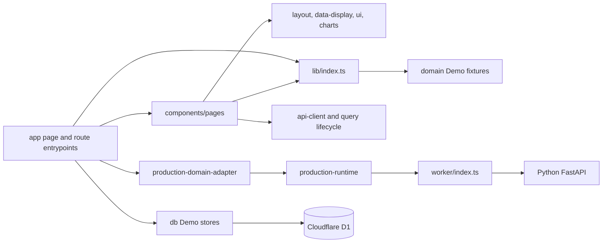
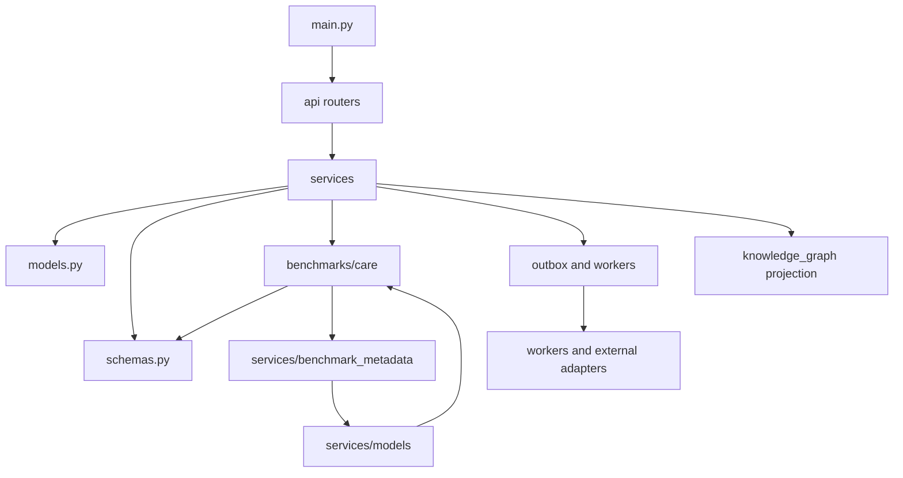
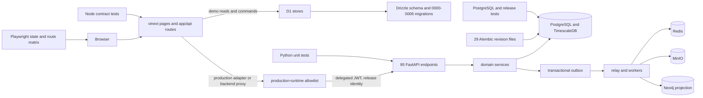

# OpenVigil Refactor Plan

本文件是 `REFACTOR_PROMPT.md` 对应的分阶段重构计划。计划以当前 checkout 的实际代码、依赖图和当次基线命令为依据，不把历史 `EXECUTION_PROGRESS.md` 中的完成记录当成本次重构证据。

## 1. Baseline Identity

- Repository: `C:\Users\jy\Documents\GitHub\OpenVigil`
- Branch: `main`
- Baseline HEAD: `e624bf7bc2042b65cd39c572b387ddb8c76252ad`
- Baseline date: `2026-09-10` (`Asia/Shanghai`)
- Initial worktree: `REFACTOR_PROMPT.md` 为用户提供的未跟踪文件；不得覆盖、清理或提交。
- Runtime tools: Node `v24.18.1`, pnpm `11.21.0`, uv `0.12.1`; backend frozen environment uses CPython `3.12.13`.

## 2. Non-negotiable Boundaries

本轮只做可维护性重构和完成重构所需的关联门禁修复。以下边界不可改变：

1. Demo 与 Production 严格隔离；Production 失败关闭且无 fixture、D1、WT-023 或模拟事件回退。
2. Sites Worker 继续负责前端托管、身份和生产 API 网关；Python 后端仍是独立部署的权威服务。
3. PostgreSQL/TimescaleDB 是生产事实权威；Neo4j 仍是可重建投影。
4. RBAC、scope、capability、人工审批、revision、幂等、outbox、lease 和 fencing 语义不弱化。
5. 不改写既有 Drizzle/Alembic 迁移历史；本轮没有 schema 需求时不新增迁移。
6. `windops_backend`、`WINDOPS_*`、`x-windops-*`、数据库/队列/bucket/协议标识作为兼容命名空间保留。
7. CARE 真值隔离、质量 mask、批准根、制品摘要、模型追溯、许可证和发布门禁不简化。
8. `.gitmodules` 与固定 CARE gitlink 保留；本地 `tmp/` 不能代替干净克隆证据。
9. 不做视觉改版、功能扩张、依赖升级、全局重命名或大面积无关格式化。
10. 每批只处理一个根因；目录移动与逻辑变化尽量分开。

## 3. Current Module Inventory

### 3.1 Frontend, Worker and Demo data

- 22 App Router product pages.
- 37 Worker/App route modules（含 34 `app/api/**/route.ts` 与 3 Demo WebSocket route）。
- 159 production TypeScript modules under `app/`, `components/`, `lib/`, `db/`, `worker/`, `build/`.
- Main boundaries:
  - `app/**/page.tsx`: route entrypoints.
  - `components/pages/`: feature/page composition.
  - `components/layout`, `components/data-display`, `components/ui`, `components/charts`: shared presentation.
  - `lib/`: Demo fixtures, query/runtime adapters, workflow/state and cross-cutting helpers.
  - `db/`: D1 Demo stores and Drizzle schema.
  - `worker/index.ts`: Sites security boundary and vinext entry.

### 3.2 Backend

- 100 Python modules under `backend/src/windops_backend`.
- 95 FastAPI endpoints under `/api/v1`.
- 27 console-script entrypoints declared in `backend/pyproject.toml`; all target modules and functions exist.
- Main packages: `api`, `services`, `agents`, `knowledge_graph`, `benchmarks/care`, `operations`.
- 29 Alembic revision files with one head `0028_read_audit_pipeline`.
- 7 immutable Drizzle/D1 SQL migrations, `0000` through `0006`.

### 3.3 Tests and deployment

- 46 Node/Playwright test source files and 68 Python test files, of which 9 are external-environment suites.
- CI separates frontend, browser, real cross-layer, backend, PostgreSQL and CARE PostgreSQL gates.
- Release requires an exact 11-gate content-addressed evidence set and a single final verifier.
- Kubernetes includes API, general worker, outbox relay, read-audit worker/maintenance, migration, backup and isolated CARE workload.

## 4. Dependency Graph

### 4.1 TypeScript import graph

Static graph generated with the installed TypeScript parser (`ts.preProcessFile`):

- Nodes: `159`
- Internal edges: `672`
- Strongly connected components with more than one node: `0`
- Runtime-reachable modules: `157`
- Non-page runtime roots: `worker/index.ts`; `db/schema.ts` is a Drizzle build root and `build/sites-vite-plugin.ts` is a Vite config root, not runtime orphans.
- Highest fan-in: `lib/production-runtime.ts` 66, `lib/types.ts` 49, `lib/index.ts` 35.
- Highest fan-out page containers: Agent 19, Dashboard 17, Alarm 16, Mission Detail 16, Work Order 16.



Root cause: `lib/index.ts` is both a type/export facade and a runtime fixture aggregator. Thirty-five imports can load unrelated Demo domains through a single barrel even when a page needs one symbol. No current TS cycle exists, so the refactor must preserve this property.

### 4.2 Python import graph

Static graph generated with Python AST:

- Nodes: `100`
- Internal edges: `425`
- One multi-module strongly connected component:

```text
benchmarks.care.anomaly
  -> benchmarks.care.evaluation
  -> benchmarks.care.importer
  -> schemas
  -> services.benchmark_metadata
  -> services.models
  -> (back to CARE modules)
```

High fan-in modules are `models` (42), `config` (33), `errors` (33), and `schemas` (32). The CARE package `__init__.py` is also an over-wide facade importing anomaly, contract, pipeline, replay and scoring at import time.



Root cause: transport schemas, CARE artifact contracts and service orchestration share concrete types in both directions. The first backend structural change must extract dependency-neutral contracts before moving large orchestration code.

## 5. API, Worker, Database, Migration and Test Relationships



Important compatibility points:

- Worker production requests pass through `enforceProductionRequestBoundary`, document authorization, path/method/body allowlist, delegated identity and release identity validation.
- Demo workflow, alarm, Agent execution and knowledge passage stores own separate D1 initialization and CAS/idempotency/audit behavior.
- API routers are flattened through `windops_backend.api.router` to preserve the existing route table; refactors must assert the 95-route signature.
- The database graph is append-only at the migration level. Refactoring models or repositories must not generate schema drift.
- Tests are the proof boundary: source-level tests do not replace Playwright, real PostgreSQL, image, protected release or external-provider evidence.

## 6. Size and Responsibility Hotspots

| File                                         | Lines | Current mixed responsibilities                                             |
| -------------------------------------------- | ----: | -------------------------------------------------------------------------- |
| `app/globals.css`                            | 8,287 | tokens, reset, shell, shared components, responsive rules and page styling |
| `benchmarks/care/fullscale.py`               | 4,357 | artifact I/O, training, prediction, verification, registration and CLI     |
| `services/operational_views.py`              | 1,947 | multiple bounded read models and serialization                             |
| `lib/agent-tool-runtime.ts`                  | 1,934 | tool contracts, execution, fixtures and validation                         |
| `benchmarks/care/evaluation.py`              | 1,875 | package I/O, evaluation, verification and CLI                              |
| `services/benchmark_catalog.py`              | 1,853 | dataset, evaluation, diagnosis and curve catalogs                          |
| `lib/operations-data.ts`                     | 1,725 | several Demo business domains                                              |
| `benchmarks/care/pipeline.py`                | 1,635 | stores, job control, Parquet conversion and CLI                            |
| `benchmarks/care/scoring.py`                 | 1,562 | score contracts, evaluator, artifacts and CLI                              |
| `models.py`                                  | 1,551 | all SQLAlchemy bounded contexts                                            |
| `components/pages/data-center-page.tsx`      | 1,472 | queries, state conversion and multiple UI sections                         |
| `lib/production-domain-adapter.ts`           | 1,422 | all frontend production domain translations                                |
| `benchmarks/care/anomaly.py`                 | 1,389 | contracts, gates, alert state and CLI                                      |
| `components/pages/mission-detail-page.tsx`   | 1,362 | query orchestration, evidence, timeline and actions                        |
| `services/models.py`                         | 1,359 | registry, verification, activation, rollback and inference                 |
| `components/pages/alarm-center-page.tsx`     | 1,281 | query/mutation state, table and details                                    |
| `components/pages/work-order-page.tsx`       | 1,272 | query/mutation state, evidence form and presentation                       |
| `components/pages/model-management-page.tsx` | 1,221 | registry, CARE evaluation, gates and deployment UI                         |
| `components/pages/agent-control-page.tsx`    | 1,215 | catalog, commands, executions and presentation                             |
| `components/pages/dashboard-page.tsx`        | 1,206 | data normalization and all dashboard sections                              |
| `benchmarks/care/importer.py`                | 1,189 | manifest verification, storage, registration and CLI                       |
| `agents/tools.py`                            | 1,161 | contracts, SQL implementations and tool catalog                            |
| `services/benchmark_metadata.py`             | 1,141 | all CARE persistence commands                                              |
| `schemas.py`                                 | 1,109 | all API bounded contexts and compatibility validators                      |

Repeated-infrastructure candidates, subject to semantic comparison before consolidation:

- CARE canonical JSON/hash/file/path helpers across anomaly, contract, importer, pipeline, replay, scoring, evaluation and fullscale.
- Atomic JSON/report writers across CARE and release operations.
- Worker `errorResponse`, record guards and integer query parsing across App routes.
- UTC normalization helpers across backend services.
- Small UI time/date/hash/record helpers across page containers.

The inventory is not deletion proof. A repeated name is only a candidate; protocol-specific hash and validation semantics remain separate unless byte-for-byte contracts prove equivalence.

## 7. Baseline Validation

| Command                                            | Result                      | Evidence boundary                                                                                        |
| -------------------------------------------------- | --------------------------- | -------------------------------------------------------------------------------------------------------- |
| `git status --short --branch`                      | PASS                        | Initial state only had untracked user `REFACTOR_PROMPT.md`.                                              |
| `uv sync --frozen --all-extras --all-groups`       | PASS                        | CPython 3.12.13, 161 locked packages.                                                                    |
| `uv run pytest`                                    | PASS WITH SKIPS             | `397 passed, 28 skipped in 552.90s`; skips are external-environment tests, not release evidence.         |
| Ruff format + lint                                 | PASS                        | `212 files already formatted`; all checks passed.                                                        |
| strict mypy                                        | PASS                        | 100 source files.                                                                                        |
| CARE dependency/CLI closure                        | PASS                        | 9 CARE imports, 10 runtime CLI checks, locked package versions and lock hashes verified.                 |
| Alembic head/declaration/offline chain             | PASS                        | Unique head `0028_read_audit_pipeline`; full `0001 -> 0028` SQL render succeeds.                         |
| `pnpm install --frozen-lockfile`                   | FAIL                        | `ERR_PNPM_IGNORED_BUILDS` for esbuild, sharp and workerd; current repo has no valid committed approval.  |
| frontend build/typecheck/lint/format/artifact gate | BLOCKED BY BASELINE INSTALL | pnpm invokes dependency status check and exits on the same ignored-build gate before the target command. |
| Playwright                                         | UNVERIFIED                  | Must wait for a valid repository-level install and production build.                                     |
| real PostgreSQL / container / protected release    | UNVERIFIED                  | Not executed during this local baseline; historical evidence is not current-tree proof.                  |

## 8. Phased Refactor

Each item moves `TODO -> IN_PROGRESS -> DONE` only after implementation, targeted validation, related regression and diff review.

### RF-001 — Reproducible frontend dependency gate

- Root cause: required packages have install scripts but the repository lacks a valid pnpm `allowBuilds` decision; every frontend command fails before source validation.
- Scope: `pnpm-workspace.yaml` and supply-chain/installation contract tests only.
- Change: explicitly allow only `esbuild`, `sharp`, and `workerd`; reject broad or wildcard approval.
- Risk: malicious lifecycle script expansion.
- Validation: frozen install, build, bundle, typecheck, lint, format, Node tests and repository-artifact gate.

### RF-002 — Remove runtime dependence on the broad frontend barrel

- Root cause: `lib/index.ts` loads unrelated Demo fixture domains and has fan-in 35.
- Scope: page/API imports, domain modules and an import-boundary test.
- Change: import types/data/functions from their owning modules; keep a compatibility facade only where an explicit external/test contract needs it.
- Risk: server/client bundle changes or accidental Production fixture reachability.
- Validation: import graph remains acyclic; no page/API route imports `@/lib`; production fallback tests, bundle budget and full Node suite.

### RF-003 — Consolidate Worker/App-route primitives

- Root cause: structured error envelopes, record guards, bounded integers and production proxy branches are repeated in route modules.
- Scope: `app/api/_shared.ts` plus a small number of routes per batch.
- Change: pure helpers with stable error shape/status/meta; no shared mutable state.
- Risk: error-code/status/body drift.
- Validation: route contract tests for success, invalid input, Production proxy and D1-unavailable cases.

### RF-004 — Split the largest frontend feature containers

- Root cause: page components combine data acquisition, state transitions, normalization and many visual sections.
- Scope in order: Dashboard, Mission Detail, Data Center, Model Management, then Alarm/Work Order/Agent only where responsibility remains mixed after shared extraction.
- Change: feature-local `hooks`, `contracts/state`, and presentational sections; page route and top-level container stay thin.
- Risk: query lifecycle, focus, responsive order, keyboard and visual regressions.
- Validation: targeted Node tests, type/lint/format/build, relevant Playwright state matrix and approved screenshots.

### RF-005 — Physically separate global CSS without visual changes

- Root cause: `app/globals.css` owns unrelated tokens, base, shell, shared component and page/responsive rules.
- Scope: CSS files under `app/styles/` plus a thin ordered `globals.css` import entry.
- Change: move contiguous rule groups without selector/value edits; preserve cascade order exactly.
- Risk: import/cascade drift and screenshot changes.
- Validation: CSS contract, production build, typography/responsive E2E and screenshot comparison at 1440, 1280, 900 and 390 widths.

### RF-006 — Break the Python CARE/service import cycle

- Root cause: CARE contracts depend on monolithic API schemas/services while model services depend back on CARE gates.
- Scope: dependency-neutral CARE/domain contract modules and stable re-exports.
- Change: move pure types/validators first; keep public import paths; assert no multi-node SCC.
- Risk: Pydantic/SQLAlchemy type identity, CLI import and serialization drift.
- Validation: import graph, all 27 CLI targets, CARE/model/API targeted suites, Ruff and strict mypy.

### RF-007 — Split backend models and schemas by bounded context

- Root cause: `models.py` and `schemas.py` are central fan-in modules containing unrelated domains.
- Scope: identity/assets, operations/workflow, agents/knowledge, model/CARE and governance/read-audit contexts.
- Change: move declarations in reviewable batches; original modules keep stable explicit re-exports; SQLAlchemy metadata and Pydantic wire schemas remain identical.
- Risk: table metadata order, relationship resolution, Alembic drift and import compatibility.
- Validation: schema snapshot/import compatibility, `alembic check` on real PostgreSQL when available, offline chain, API tests and strict mypy.

### RF-008 — Unify CARE artifact infrastructure and split orchestration

- Root cause: CARE modules repeat canonical JSON/hash/safe-path/atomic-write code and mix contracts, I/O, training, prediction, verification and CLI orchestration.
- Scope: shared CARE artifact utilities, then `fullscale.py`, `evaluation.py`, `pipeline.py`, `scoring.py`, `anomaly.py` in separate batches.
- Change: consolidate only proven-identical infrastructure; retain stable imports and console entrypoints; separate I/O, quality/training/prediction/scoring/verifier/orchestrator responsibilities.
- Risk: content hashes, golden vectors, approved-root lineage, mask/truth isolation, resume/idempotency and CLI behavior.
- Validation: golden and tamper tests, CARE full non-external suite, CLI closure, strict mypy; real source/PostgreSQL/full-scale evidence remains explicitly `UNVERIFIED` unless rerun.

### RF-009 — Split broad backend read/service modules

- Root cause: `operational_views.py`, `benchmark_catalog.py`, `services/models.py`, `agents/tools.py` and `benchmark_metadata.py` span multiple bounded contexts.
- Scope: one service at a time, beginning with pure serializers/read queries.
- Change: repositories/query objects/contracts separated from API serialization and orchestration; stable facade functions retained.
- Risk: authorization scope, pagination, SQL shape, transaction boundaries and error codes.
- Validation: related API/service tests, query-count/performance contracts where applicable, PostgreSQL tests when available, Ruff/mypy.

### RF-010 — Consolidate release/operation report helpers

- Root cause: operation CLIs duplicate file hashing, safe report paths and atomic JSON output.
- Scope: dependency-neutral operation evidence utilities; no gate-policy merging.
- Change: centralize identical low-level I/O while each verifier keeps its own required checks and schema.
- Risk: evidence identity or fail-closed policy drift.
- Validation: release/deployment/container/DR negative suites and CLI closure.

### RF-011 — Documentation, orphan/dependency checks and final convergence

- Root cause: architecture documentation and automated topology gates must match the refactored tree.
- Scope: `ARCHITECTURE.md`, README directory map if needed, refactor docs and topology checks.
- Change: record final structure; add repeatable TS/Python cycle, orphan, public route/CLI and dependency checks without deleting anything solely from static suspicion.
- Risk: stale documentation or false-positive topology policy.
- Validation: repository artifacts, Markdown local links, unused dependency/orphan review, full required command matrix and `git diff --check`.

## 9. Completion Procedure

After RF-001 through RF-011 are `DONE`:

1. Re-read `REFACTOR_PROMPT.md`, this plan and progress from the first item to the last.
2. Run a full recheck for partial moves, duplicate infrastructure, cycles, orphan modules, route/API/error/permission/data drift and documentation drift.
3. Run adversarial review for invalid input, empty/error/stale/conflict/result-unknown, repeated action, permission, concurrency, restart, partial failure and production configuration.
4. Run final frontend/backend/repository validation from the final tree.
5. Run two consecutive final audits. A newly discovered Critical/High resets the counter to `0 / 2` after repair.
6. Report current-tree `PASS`, `SKIPPED`, `UNVERIFIED` and remaining risks separately.

The goal can end only when `REFACTOR_PROGRESS.md` is synchronized with Git state and all ten requirements in `REFACTOR_PROMPT.md` section 8 are evidenced.
